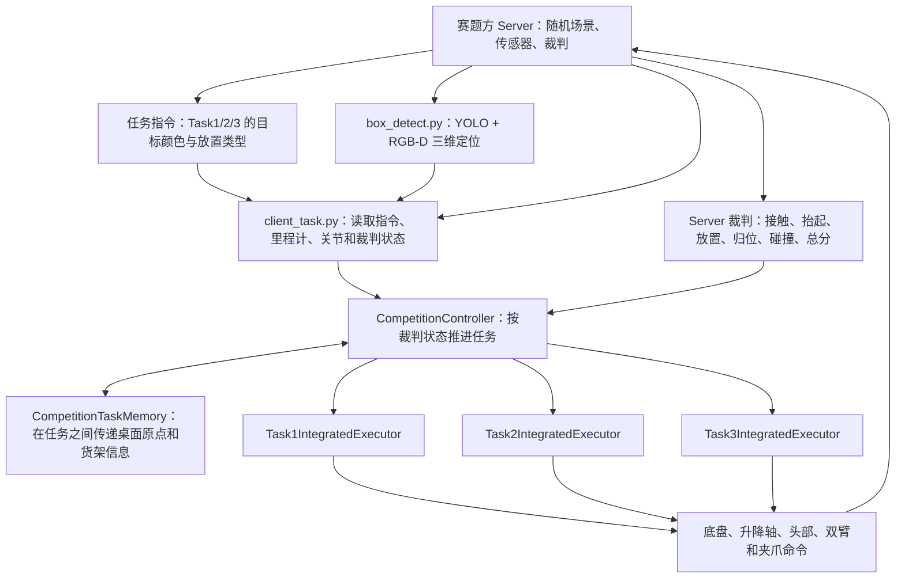

# SIX ANGELS Material Sorting：Task1 + Task2 + Task3 完整运行说明

这份代码是已经在赛题方 Server/Client 容器中完成三任务联通的版本。2026-08-09 使用随机场景实测：

```text
Task1：40/40
Task2：60/60
Task3：60/60
总分：160/160
碰撞：0
```

最终裁判原文见 [`FULL_SCORE_RESULT.txt`](FULL_SCORE_RESULT.txt)。

本文档回答四个问题：

1. 代码应该放到哪个容器、哪个路径。
2. 赛题方 Server 和本项目 Client 应该按什么顺序启动。
3. 怎样确认三个任务确实在连续运行并实时查看得分。
4. Task1、Task2、Task3 分别采用什么思路完成。

---

## 1. 系统组成和数据流

赛题环境由两个容器组成：

- **Server 容器**：赛题方官方仿真、随机场景、任务发布和裁判计分。不要把本项目代码覆盖到 Server。
- **Client 容器**：运行本仓库中的 YOLO/RGB-D 感知、导航、双臂控制和三任务状态机。

本机验证时使用的容器名：

```text
Server：qc_eval_server_task123
Client：qc_eval_client_task123
```

如果队友机器上的名称不同，只需要替换后文命令中的容器名。



任务切换不是由本地代码强行跳转。每个任务本地动作完成后，Client 会等待 Server 裁判确认；只有裁判进入下一任务，`CompetitionController` 才启动下一个执行器。

---

## 2. 代码目录和关键入口

代码在 Client 容器中的固定部署路径：

```text
/workspace/baseline/material_sorting_task
```

主要文件：

```text
scripts/run_client.sh
    同时启动感知进程和正式 Client。

examples/material_sorting/perception/box_detect.py
    YOLO 检测、深度点云处理、三维中心和物体朝向发布。

examples/material_sorting/perception/checkpoints/best.pt
    当前使用的 YOLO 权重，必须保留。

examples/material_sorting/client_task.py
    ROS 2 Client 入口，读取指令、检测、里程计、关节和裁判状态。

examples/material_sorting/competition_controller.py
    三任务公共状态机以及与 Server 裁判的同步逻辑。

examples/material_sorting/executors/__init__.py
    根据 MATERIAL_EXECUTION_MODE 注册 Task1、Task2、Task3 执行器。

examples/material_sorting/executors/task1_full.py
    Task1 完整抓取、运输、货架放置和返回逻辑。

examples/material_sorting/executors/task2.py
    Task2 货架中心抓取、拉出、运回原桌面点逻辑。

examples/material_sorting/executors/task3.py
    Task3 浅抓、左转、货架左侧浅放、松爪退出逻辑。

examples/material_sorting/shelf/task_memory.py
    保存 Task1 原桌面坐标、货架层等跨任务信息。

examples/material_sorting/desktop_grasp/pregrasp_core.py
    双臂预抓、夹紧、抬升和释放控制器。
```

正式三任务模式必须是：

```text
MATERIAL_EXECUTION_MODE=task123_full
```

在该模式下，`executors/__init__.py` 创建一份共享的 `CompetitionTaskMemory`，然后注册：

```python
{
    1: Task1IntegratedExecutor(memory),
    2: Task2IntegratedExecutor(memory),
    3: Task3IntegratedExecutor(memory),
}
```

不要使用 `task12_full`，它只会完整运行 Task1 和 Task2。`task3_only` 只是跳过前两个任务的物理诊断模式，不属于正式计分联通模式。

---

## 3. 第一次部署到赛题方 Client 容器

以下命令在 Windows PowerShell 中运行。

### 3.1 确认容器存在

```powershell
docker ps -a --format "table {{.Names}}\t{{.Status}}"
```

应能看到 Server 和 Client 容器，例如：

```text
qc_eval_server_task123
qc_eval_client_task123
```

### 3.2 备份 Client 容器中的旧代码

```powershell
docker cp qc_eval_client_task123:/workspace/baseline/material_sorting_task `
  .\material_sorting_task_backup
```

### 3.3 把本仓库复制到 Client 容器

假设当前 PowerShell 位于本仓库根目录：

```powershell
docker cp .\. qc_eval_client_task123:/workspace/baseline/material_sorting_task/
```

这里的 `.` 表示复制仓库内容，而不是再在目标目录中套一层同名文件夹。

### 3.4 检查关键文件

```powershell
docker exec qc_eval_client_task123 `
  test -f /workspace/baseline/material_sorting_task/examples/material_sorting/perception/checkpoints/best.pt
```

```powershell
docker exec qc_eval_client_task123 `
  grep -n -E "task123_full|TASK3_ENABLE_PUSH" `
  /workspace/baseline/material_sorting_task/examples/material_sorting/executors/__init__.py `
  /workspace/baseline/material_sorting_task/examples/material_sorting/executors/task3.py
```

必须看到 `task123_full`，并且 Task3 必须是：

```python
TASK3_ENABLE_PUSH = False
```

### 3.5 语法检查

```powershell
docker exec qc_eval_client_task123 bash -c `
  "cd /workspace/baseline/material_sorting_task/examples/material_sorting && python3 -m py_compile client_task.py competition_controller.py executors/task1_full.py executors/task2.py executors/task3.py desktop_grasp/pregrasp_core.py perception/box_detect.py"
```

没有 Python 报错即通过。

---

## 4. 每一局三任务的完整启动流程

这一节是正式运行时应直接照做的顺序。

### 步骤 1：重启 Server 和 Client，清理上一局

```powershell
docker restart qc_eval_server_task123 qc_eval_client_task123
```

重启 Client 会清掉上一局仍在运行的 `client_task.py` 和 `box_detect.py`，防止多个 Client 同时发布机器人命令。Docker 重启不会删除已经复制进容器的代码。

### 步骤 2：等待 Server 发布新的随机任务

```powershell
docker logs --since 30s qc_eval_server_task123
```

正常时会看到类似：

```text
[server] referee enabled
[server] task instructions:
   任务1: 抓取桌面右侧的粉色方块，放到货架空层
   任务2: 抓取货架中的褐色方块，放到第一个方块原来在桌子上的位置
   任务3: 抓取白色正方体顶部的黄色方块，放到货架中白色长方体的左边
```

三种颜色、桌面左右侧以及货架层每一局都可能变化。代码不能写死目标颜色，必须以 Server 发布的指令为准。

### 步骤 3：以 `task123_full` 启动 Client

推荐直接在宿主机 PowerShell 使用下面这条后台命令：

```powershell
docker exec -d `
  -e MATERIAL_EXECUTION_MODE=task123_full `
  -e MATERIAL_DETECT_BACKEND=yolo `
  -e PYTHONPATH=/workspace/baseline/material_sorting_task:/workspace/baseline/material_sorting_task/examples/material_sorting:/workspace/baseline/material_sorting_task/examples/material_sorting/perception `
  qc_eval_client_task123 bash -c `
  'source /opt/ros/humble/setup.bash && cd /workspace/baseline/material_sorting_task && exec bash scripts/run_client.sh > /tmp/task123_full.log 2>&1'
```

这里显式设置 `PYTHONPATH`，是为了让 `perception/box_detect.py` 能找到项目中的 `discoverse`。不要把 `bash -c` 改成 `sh -c`，否则 `source /opt/ros/humble/setup.bash` 可能失败。

如果希望在 Client 容器终端前台运行，可以执行：

```powershell
docker exec -it qc_eval_client_task123 bash
```

进入容器后：

```bash
source /opt/ros/humble/setup.bash

export ROS_DOMAIN_ID=99
export RMW_IMPLEMENTATION=rmw_cyclonedds_cpp
export MATERIAL_USE_LIDAR=0
export MATERIAL_EXECUTION_MODE=task123_full
export MATERIAL_DETECT_BACKEND=yolo
export PYTHONPATH=/workspace/baseline/material_sorting_task:/workspace/baseline/material_sorting_task/examples/material_sorting:/workspace/baseline/material_sorting_task/examples/material_sorting/perception

cd /workspace/baseline/material_sorting_task
bash scripts/run_client.sh
```

`scripts/run_client.sh` 会完成两件事：

1. 启动 `perception/box_detect.py`，加载 `best.pt` 并持续发布 RGB-D 三维检测。
2. 启动 `client_task.py`，等待 Server 指令、里程计和关节状态，然后运行三任务控制器。

### 步骤 4：确认 Client 正确进入三任务模式

```powershell
docker exec qc_eval_client_task123 tail -n 60 /tmp/task123_full.log
```

启动成功必须看到：

```text
client started; ... execution_mode=task123_full
instructions accepted: T1=... T2=... T3=...
client inputs ready; starting three-task competition controller
controller=starting_task task=1
```

YOLO 加载成功会看到：

```text
[YoloBackend] loaded .../best.pt
material_box_detect up; backend=yolo
```

### 步骤 5：实时查看 Server 得分

单独打开一个 PowerShell：

```powershell
docker logs -f --tail 50 qc_eval_server_task123
```

只看得分和任务切换：

```powershell
docker logs -f qc_eval_server_task123 2>&1 |
  Select-String -Pattern '得分|总分|完成|本局结束|>>>>>>'
```

### 步骤 6：实时查看 Client 当前动作

再打开一个 PowerShell：

```powershell
docker exec -it qc_eval_client_task123 tail -f /tmp/task123_full.log
```

按 `Ctrl+C` 只会退出日志查看，不会停止正在运行的容器或机器人。

### 步骤 7：确认最终满分

本版本已验证的最终输出是：

```text
任务1 完成，最高分 40，进入下一任务
任务2 完成，最高分 60，进入下一任务
任务3 完成，最高分 60，准备结束本局
本局结束(all_tasks_done) 总分 160 = 任务1 40 + 任务2 60 + 任务3 60
```

一次随机场景实测约 304 秒。不同随机布局和机器负载会使时间变化，不要因为某段导航较慢就重复启动第二个 Client。

---

## 5. Task1 的完整思路：桌面目标 → 货架空层

Task1 的目标颜色和桌面左右侧来自 Server 指令，不能写死为某个颜色或固定一侧。

### 5.1 感知与目标锁定

1. `box_detect.py` 根据指令目标颜色，从 RGB 图像中检测对应方块。
2. 使用深度图/点云估计目标三维中心和 `yaw0/yaw90` 朝向。
3. 连续收集稳定观测，过滤白色支撑物、错误深度和跳变目标。
4. 根据目标中心计算桌边抓取站位，底盘先到目标前方安全距离，再进行机械臂动作。

### 5.2 双臂抓取

1. 双臂完全张开，从目标两侧到达非接触预抓位置。
2. 依据方块朝向对称向内夹紧。
3. 有界增加夹紧预载，避免无限向内挤压。
4. 保持双臂夹持姿态，升降轴抬高约 `0.15 m`。

### 5.3 安全运输

1. 抓稳后先直线后退，使方块与桌面及其他物体拉开距离。
2. 前往货架安全转向点和观察位，转向时始终保持夹持。
3. `ShelfStateTracker` 根据货架观测识别随机空层，而不是使用固定层高。
4. 先在货架外完成高度和横向对齐，再正对空层进入。

### 5.4 放置与任务结束

1. 将方块下降到货架板支撑高度。
2. 张开双臂释放方块。
3. 直线后退离开货架，再收回机械臂。
4. 返回终点区域并等待 Server 裁判确认。
5. Task1 的原桌面坐标、货架信息写入 `CompetitionTaskMemory`，供 Task2 使用。

Task1 满分为 40 分。本版本已稳定完成接触、抬起、货架放置、归位，碰撞为 0。

---

## 6. Task2 的完整思路：货架目标 → Task1 原桌面点

Task2 最大风险是底盘或双臂直接撞入货架。因此该版本的原则是：**先在货架外完成中心对准和张爪，再做短距离靠近，一次夹紧后直线拉出。**

### 6.1 利用 Task1 共享记忆

Task2 从 `CompetitionTaskMemory` 读取：

- Task1 方块原来的桌面坐标，作为 Task2 最终放置点。
- Task1 阶段融合出的货架位置和层信息。
- 当前 Server 指令发布的 Task2 目标颜色。

这样 Task2 不需要在抓出方块后重新猜测桌面落点。

### 6.2 货架外安全对准

1. 导航到距离货架较远的机械臂 staging 站位。
2. 机械臂保持收回，底盘沿货架正面横向移动，对准目标方块中心。
3. 锁定 Task1/视觉融合得到的货架目标中心，避免近距离机械臂遮挡后视觉中心漂移。
4. 在货架范围外张开并降低双臂，形成安全预抓姿态。
5. 停稳后收集新一批目标中心帧，只修正中心，不让视觉误检改变货架层。

### 6.3 一次抓紧并拉出

1. 底盘做最后一小段正向靠近，目标基座前向距离约 `0.73–0.75 m`。
2. 双臂围住方块中心，做小幅 IK 精对齐。
3. 双臂同时向内夹紧，一次抓稳。
4. 升降轴先抬高约 `0.08 m`，避免方块底面摩擦货架板。
5. 保持夹紧直线后退，把方块完全拉出货架后再转向。

### 6.4 运回原桌面位置

1. 方块离开货架后升到运输安全高度。
2. 按“反向离架 → 转向 → 沿通道前进”的分段路径返回桌面。
3. 运输过程中持续计算机器人/携带物包络与货架、墙面的最小间隙。
4. 到达 Task1 保存的原桌面坐标后下降并张开双臂。
5. 直线后退、收臂、返回终点，等待 Server 进入 Task3。

Task2 满分为 60 分。本版本实测完成中心抓取、抬升拉出、原点放置、归位，碰撞为 0。

---

## 7. Task3 的完整思路：白色支撑物顶部目标 → 白色障碍物左侧

Task3 的核心难点有三个：

1. 彩色目标只露出部分表面，直接使用彩色点云中心容易偏到方块前侧。
2. 抓得过深会使方块大部分进入爪内，后续无法在不撞货架的情况下浅放。
3. 放置后若继续用机械臂推进，容易撞货架或把已经正确的方块推坏。

当前满分版本针对这三个问题采用“支撑物锚定 + 浅抓 + 只松爪退出”的方案。

### 7.1 动态颜色与白色支撑物锚定

1. Task3 目标颜色直接读取 Server 指令，可能是黄色、粉色或褐色。
2. 在远视角缓存白色 `material_box` 的 RGB-D 三维中心。
3. 彩色目标只负责确认目标类别和实际抬升；抓取几何的水平中心使用白色支撑物中心进行锚定。
4. 这样可避免彩色目标点云只覆盖可见侧面时，抓取中心向前偏移。

### 7.2 从机器人侧浅抓

当前关键几何：

```python
TASK3_PICK_STANDOFF_M = 0.620
TASK3_SHALLOW_GRIP_OFFSET_M = 0.045
TASK3_GRASP_Z_OFFSET_M = -0.010
```

含义：

- 机器人停在支撑物前约 `0.620 m` 的抓取位置。
- 抓取中心向机器人侧偏移 `0.045 m`，只夹住方块靠近机器人的一小段。
- 抓取高度比目标中心低 `0.010 m`，让夹爪从侧面稳定承托，减少下滑。
- 实际对称夹持半宽约 `0.080 m`，不会把超过一半长度吞进爪内。

执行流程：

1. 双臂张开到非接触预抓位置。
2. 使用锚定后的浅抓中心直接对称合拢。
3. 保持夹持并抬高约 `0.10 m`。
4. RGB-D 必须看到目标颜色真实上升至少约 `0.065 m`，才认为抓取成功并开始运输。

这一步不是只相信 IK 或关节到位，而是用目标颜色的实际三维高度变化证明方块确实被拿起。

### 7.3 安全离桌并强制左转

1. 抬起后保持夹持，先长距离直线后退，确保底盘和双臂离开桌边。
2. 后退完成后强制向左转到货架方向，不走右侧路线。
3. 到货架安全观察位后识别 `packaging_box`，由其随机高度确定 Task3 应放置的货架层。
4. 所有转向和横向移动先在货架外完成，再正对目标层靠近。

### 7.4 白色障碍物左侧浅放

当前关键放置参数：

```python
TASK3_RELEASE_X = -2.560
TASK3_SAFE_RELEASE_Y = 0.600
TASK3_RELEASE_BACKOFF_M = 0.140
TASK3_ENABLE_PUSH = False
```

放置逻辑：

1. 根据实时 `packaging_box` 高度选择正确层高。
2. 横向对准白色障碍物左侧的安全位置。
3. 只把方块需要的部分放到货架板上，夹爪和机械臂主体不深入货架。
4. 到达浅放姿态后冻结当前升降轴、头部和双臂关节，只打开左右夹爪。
5. 原地松开后，底盘/机械臂直线后退 `0.140 m`，完全退出货架范围。
6. 退出完成后直接判定本地放置阶段完成。

本版本**不会形成推手，也不会在松爪后再次推进方块**：

```python
TASK3_ENABLE_PUSH = False
```

正确日志必须出现：

```text
Task3 shallow placement complete: grippers opened in place and arms backed clear; visual push intentionally disabled
```

最后机器人继续退离货架、收回机械臂并返回终点，等待 Server 给出 Task3 和全局最终分数。

Task3 满分为 60 分。本版本实测完成真实抓取、抬升、左侧放置、归位，碰撞为 0。

---

## 8. 三任务之间如何联通

三任务的实际状态序列为：

```text
Server 发布三条随机指令
→ Client 解析 T1/T2/T3 的目标颜色
→ Task1 抓取并放入货架空层
→ Task1 返回终点
→ 等待 Server 确认 Task1 完成
→ Task2 读取 Task1 保存的原桌面点和货架信息
→ Task2 从货架抓出目标并放回原桌面点
→ Task2 返回终点
→ 等待 Server 确认 Task2 完成
→ Task3 使用自己指令中的目标颜色
→ Task3 浅抓、左转、浅放、松爪退出
→ Task3 返回终点
→ Server 输出总分
```

执行器内部每个任务使用相同的阶段接口：

```text
navigate_to_pick
→ acquire_target
→ align_for_pick
→ grasp
→ lift
→ transport
→ align_for_place
→ place
→ verify_place
→ return_to_end
```

`CompetitionController` 负责阶段切换、尝试次数和裁判同步；具体动作由三个 IntegratedExecutor 完成。

---

## 9. 常见故障与判断方法

### 9.1 `ModuleNotFoundError: No module named 'discoverse'`

原因：启动 Client 时没有包含项目根目录的 `PYTHONPATH`。

处理：使用第 4 节给出的完整后台启动命令，不要省略：

```text
/workspace/baseline/material_sorting_task
```

### 9.2 Task1 等待检测超时，得分一直是 0

先查看：

```powershell
docker exec qc_eval_client_task123 tail -n 100 /tmp/task123_full.log
```

确认是否出现：

```text
[YoloBackend] loaded .../best.pt
material_box_detect up; backend=yolo
```

如果没有，检查 `best.pt` 是否存在、感知进程是否因 Python 路径失败。

### 9.3 只运行 Task1/Task2，Task3 不进入

检查日志中的：

```text
execution_mode=...
```

必须是 `task123_full`，不能是 `task12_full`。

### 9.4 使用 `task3_only` 没有正式分数

`task3_only` 是物理诊断模式，会跳过 Task1/Task2；正式裁判联通必须使用 `task123_full`。

### 9.5 机器人收到重复或异常命令

通常是同时启动了多个 Client。直接重启 Client 容器，再只启动一次：

```powershell
docker restart qc_eval_client_task123
```

### 9.6 Server 没有产生新随机场景

新一局前重启 Server：

```powershell
docker restart qc_eval_server_task123
```

然后先从 Server 日志确认新的三条任务指令，再启动 Client。

### 9.7 Task3 松爪后仍然推进

说明容器内不是当前满分版。检查：

```powershell
docker exec qc_eval_client_task123 grep -n "TASK3_ENABLE_PUSH" `
  /workspace/baseline/material_sorting_task/examples/material_sorting/executors/task3.py
```

必须是：

```python
TASK3_ENABLE_PUSH = False
```

### 9.8 去哪里看分数

正式得分以 **Server 容器日志**为准，不以 Client 自己的动作说明为准：

```powershell
docker logs -f qc_eval_server_task123
```

---

## 10. 当前满分版本不要随意改动的部分

- 不修改已经满分的 Task1 抓取和货架放置链。
- Task2 保持“货架外中心对准和张爪 → 短距离靠近 → 一次夹紧 → 直线拉出”。
- Task3 保持白色支撑物中心锚定和向机器人侧 `0.045 m` 的浅抓偏移。
- Task3 必须向左转去货架。
- Task3 保持“浅放 → 只打开夹爪 → 后退 `0.140 m` → 完成”。
- 不重新启用 Task3 推手或二次推进。
- 不把正式运行模式改回 `task12_full` 或 `task3_only`。

---

## 11. 版本完整性

[`SHA256SUMS.txt`](SHA256SUMS.txt) 保存了交付目录中各文件的 SHA-256。关键源码已经与跑出 160 分的 Client 容器逐一比对，内容一致。

本目录已删除运行缓存、`.pyc`、历史 `.bak`、失败版本、临时日志和 Git 元数据；保留了正式源码、配置、模型、测试、文档、依赖与启动脚本。
