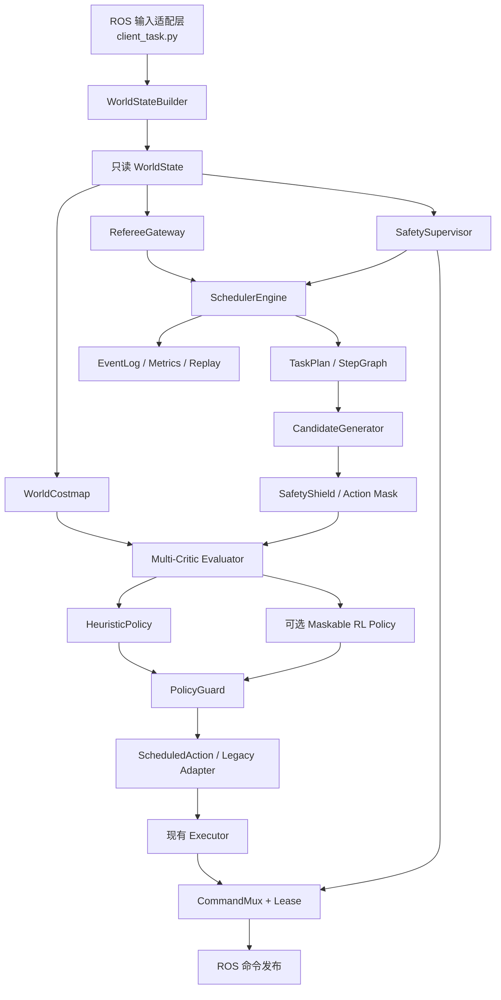

# SIX-ANGELS 任务调度实施方案（0813 最新工作区）

## 0. 文档定位

本文面向 `0813` 工作区的后续实施人员，给出从当前固定三任务状态机演进到“裁判约束、
安全优先、代价地图辅助、可选强化学习排序”的完整改造方案。

本文基线：

- GitHub 仓库：`https://github.com/Sherlly-Alex/SIX-ANGELS.git`
- 分支：`master`
- 拉取时 HEAD：`4828d5d3990350913998981381196a9492fb77b9`
- 语义优化来源：`8a224228208672d23ae32d171014d01a181d487d`
- 正式执行入口：`material_sorting_task/examples/material_sorting/client_task.py`
- 正式三任务模式：`MATERIAL_EXECUTION_MODE=task123_full`

### 2026-08-17 远程验收与后续实施状态

已封板的满分回退基线为 `v5.0.0`（提交 `9b80c76`）。官方 Server 中的连续三任务路径已取得
160/160，并完成多种子自动验收；原始日志、单轮校验和矩阵校验方法见
`material_sorting_task/docs/REMOTE_FULL_SCORE_ACCEPTANCE.md`。§18.4 开始的改动属于满分标签之后的
下一实施批次，不会移动该回退标签。
已落地：

- `legacy / shadow / v2` 三模式 facade；官方满分与运行健康门通过后，正式默认已切换为
  `v2 + heuristic`，`MATERIAL_SCHEDULER_ENGINE=legacy` 保留为单命令回退。
- 三个独立 TaskPlan 实例（当前仍复用同一十阶段拓扑）；Task 3 终局清理由
  `TerminalPolicy` 表达，不再由 V2 写死任务号。
- `SchedulerEngine` 非阻塞执行、裁判同步、结构化事件、资源原子租约、命令校验、底盘
  150 ms lease、安全主管和重复裁判失配闭锁。
- `WorldCostmap` 版本快照、动态障碍 TTL/置信度、现有 A*/footprint/携物包络复用。
- 中心/左右偏站位候选、硬过滤、确定性 Multi-Critic、动作保持与切换滞回；结构化失败已通过
  `RecoverableStageAction` 接入 V2 主执行路径，并按 Step 可逆性与恢复预算 fail-closed。
- 后台单线程、最高 4 Hz 的导航候选重评估，不阻塞 20 Hz 控制 tick。
- 固定离散宏动作、action mask、观测 schema、奖励去重、Gymnasium 兼容环境、域随机化、
  MaskablePPO 延迟加载接口。
- `rl_shadow / rl_guarded`、模型 SHA256/schema 校验、超时/NaN/越界/masked/低安全下界回退。
- 正式语义 JSON 严格准入和 Regex/ML/SLM 只读审计旁路已经合并进同一工作区。
- 完整 ArmCommand 被视为持续位置保持；所有可能继续发布该命令的阶段（包括
  `NAVIGATE_TO_PICK`）均持有完整机械臂资源，阶段间由持久 hold lease 接管，关闭时释放。
- Task 1/2/3 的可重规划导航段已实现 `apply_scheduler_candidate(...)` opt-in hook：候选必须通过
  站位走廊（横向 ≤0.15 m、纵向 ≤0.10 m）、分层栅格无碰撞、站位净空 ≥0.22 m 和
  `NavigationController` 实际重规划四道校验。与已标定名义站位不一致的可选候选只记录为 `audit_only`并回退到名义轨迹；非法输入、碰撞/净空和重规划失败仍 fail-closed。应用结果明确记录为
  `applied / audit_only / too_late`；Task 2 分段 transport 保持 `audit_only`。
- 首个导航候选提供 100 ms 可配置、有上限且不阻塞 ROS tick 的等待窗，消除后台决策线程
  恰好错过第一个 20 Hz tick 时的静默失效；超过窗口立即执行既有确定性轨迹。
- detection epoch 通过正式 instruction 的 `task` id 解析执行器，已修复 0-based `task_index`
  被误当作 1/2/3 执行器 key 的问题。
- fatal safety code 和非法 failure code 不再被恢复包装层转换成普通恢复耗尽；前者直接
  SAFE_HOLD，后者到达引擎类型校验边界后 SAFE_HOLD。

当前明确保留的上线闸门：

- 代价地图/RL 已实时计算和记录“哪个有限宏动作效用最高”；Task 1/2/3 的可重规划站位
  hook 已在代码层开放，`v2 + heuristic + task123_full` 已获官方满分链路放行，但抓取/放置
  低层轨迹仍不由策略改写。
- `v2 + heuristic + task123_full` 已通过官方 Server 连续三任务 160/160 和多种子验收；
  `legacy` 仍保留为一键回退路径，新增 feature gate 仍需逐项独立放行。
- `rl_guarded` 是可用的受约束运行时路径，不等于已经获得实机放行；无批准模型时始终回退
  `HeuristicPolicy`，且项目不下载任何权重。
- transport 已能把实测物体中心/半宽送入 carried-envelope 与候选 costmap，但默认关闭；
  只有 `v2 + MATERIAL_MEASURED_CARRY_GUARD=1` 才启用，legacy/shadow 始终保持原验证路径。
  此开关必须在官方镜像完成尺寸、净空和误检标定后才能放行。
- 当前在线候选 Provider 只覆盖导航阶段，且默认不生成恢复候选；结构化恢复桥已上线到 V2，
  Executor 失败码迁移已覆盖 Task 1 以及 Task 2/3 的首批“不可逆动作前”导航/目标观测站点；
  其他未结构化 BLOCKED 仍保持 legacy fail-closed 语义，不能宣称全部失败均可自动恢复。
- odometry/joint state 已在 §18.4 接入统一 `INPUT_STALE` watchdog：短暂断流立即零底盘并
  保持最后有效手臂命令，2.0 s 有界宽限内允许恢复，超时进入 SAFE_HOLD；官方 Server
  断流注入已观测两类 stale/recovered 和 joint_states terminal，专项验收通过。

### 必须坚持的架构结论

1. Server 结构化 JSON 是正式任务语义的唯一真值。
2. Server 裁判决定正式任务序号、尝试结算和任务推进。
3. Safety Supervisor 的优先级高于任何调度策略、代价函数和 RL 策略。
4. 代价地图用于选择路径、站位和恢复动作，不得改变裁判指定的 Task 顺序。
5. RL 只允许从已经通过硬约束过滤的有限宏动作中选择，不直接输出底盘或双臂控制量。
6. 当前非阻塞 Executor 继续作为真实运动后端，第一阶段不重写抓取和放置控制器。
7. 每次迁移必须支持 Legacy/Shadow/V2 三种模式，并可一键退回 Legacy。

---

## 1. 0813 最新代码变化及其调度影响

`aa819cb` 之后的最新主线包含四组关键变化。

### 1.1 连续柔顺抓取

相关提交：

- `424a954 Use continuous compliant grasp approach`
- `4828d5d Extend continuous compliant grasp approach`

主要变化：

- 抓取目标不再只按离散毫米步进更新，而是根据控制周期持续向内重规划。
- 首次接触后降低另一侧搜索速度。
- 支持左右腕部分别锁定、单侧接触等待、有限回退和一次重试。
- 通过腕部第 6 关节角度、速度及相对 effort 变化判断接触。
- 加入软 effort 上限、绝对 effort 上限和最大位移边界。

调度影响：

- `GRASP` 不应被视作一个不可观察的黑盒阶段，而应暴露 `approach / single_contact /
  bilateral_lock / preload / settled` 子相位。
- 单侧接触不是立即失败，应映射为有限的局部恢复。
- effort 达到硬上限必须映射为 `FATAL_SAFETY`，不能由 RL 继续尝试。
- 已产生接触后切换站位或重做导航属于高风险动作，必须先执行明确的退臂动作。

### 1.2 三任务柔顺放置

相关提交：`94baea5 Add compliant placement to all three tasks`

主要变化：

- 新增 `shelf/placement_feedback.py`。
- Task 1、Task 2、Task 3 分别持有独立的 `CompliantSlideLoweringController`。
- 放置过程中使用 slide 与双臂 effort 相对基线判断物体是否获得支撑。
- effort 不可用时仍保留几何目标作为硬回退。

调度影响：

- `PLACE` 应拆成 `baseline / descend / contact_candidate / contact_confirm /
  release / post_release_cleanup`。
- effort 证据只能提前结束下降，不能取消几何安全边界。
- 物体释放是不可逆边界；越过边界后失败必须进入裁判结算或安全收尾，不能重新执行抓取。
- Task 3 裁判可能在本地撤离完成前宣布全部结束，必须用通用 `cleanup=True` 标记处理，
  不能继续保留 Task 3 编号特判。

### 1.3 抓取指标与绘图

相关提交：`2798813 Add compliant grasp metrics and plots`

新增：

- `scripts/record_grasp_metrics.py`
- `scripts/plot_grasp_metrics.py`
- `docs/COMPLIANT_GRASP_METRICS.md`

调度影响：

- 这些只读测量工具应扩展为调度 EventLog 的数据来源。
- 调度决策必须记录候选集合、各 Critic 分数、最终动作和结果，才能训练或审计 RL。
- 原始 joint effort 是执行器广义力，不得在代价函数中伪装成真实指尖牛顿力。

### 1.4 语义严格准入与旁路审计

已从 `8a22422` 接入：

- 正式 JSON 字段存在性追踪与严格校验。
- 中文文本不能补全缺失的正式执行字段。
- Regex、ML、本地 SLM 的离线评估模块。
- 默认关闭、异步、只写日志的 `SemanticAudit`。
- 研究模型缺失和推理失败不会影响正式控制。

调度影响：

- 调度器只接收已经通过 `validate_instruction(require_execution_ready=True)` 的结构化任务。
- 语义旁路结果不进入 `WorldState` 的控制真值字段，也不参与 Candidate Mask。
- 可将 `SEM_AUDIT DIFF` 作为离线数据质量事件记录，但不能阻塞、改写或重排任务。

---

## 2. 当前调度实现

当前链路为：

```text
/material/instruction + /referee/* + odom + joint_states + detections
                              |
                              v
                       client_task.py
                     20 Hz create_timer
                              |
                              v
                  CompetitionController.tick()
                              |
                 固定 TASK_STAGE_SEQUENCE
                              |
                              v
                    Task1/2/3 Executor
                              |
                              v
                    底盘与机械臂命令发布
```

### 当前优点

- 单 ROS 进程贯穿整场比赛。
- Controller 不依赖 ROS，可进行纯 Python 测试。
- Executor 使用 `enter_stage / tick / cancel`，天然适合非阻塞调度。
- 每个控制周期最多推进一次明显状态转换。
- 正式模式等待裁判确认重试与任务推进。
- 缺少底盘命令时默认发布零速度。

### 当前限制

- Task 1/2/3 强制共享全局 `TASK_STAGE_SEQUENCE`。
- `BLOCKED` 同时表达感知失败、规划失败、IK 失败和安全异常，调度器无法选择正确恢复。
- 超时、重试和恢复分散在大型 Executor 内部。
- 当前任务索引、裁判同步、执行阶段和安全状态集中在一个 Controller。
- Task 2/3 detection epoch 在 `client_task.py` 中存在任务编号特判。
- 缺少统一的资源所有权、命令租约、候选动作评分和决策事件。
- `_finishing_task3_safe_return()` 是不可扩展的任务编号特判。

---

## 3. 目标架构



### 优先级

```text
Safety hard constraints
    > Referee authority
    > Task graph invariants
    > Resource ownership
    > Deterministic recovery policy
    > Heuristic utility
    > RL preference
```

---

## 4. 核心数据模型

建议新增目录：

```text
material_sorting_task/examples/material_sorting/scheduler/
  __init__.py
  models.py
  engine.py
  plans.py
  referee.py
  recovery.py
  resources.py
  safety.py
  events.py
  candidate_generator.py
  utility.py
  legacy_adapter.py
  policies/
    heuristic.py
    shadow.py
    rl.py
    guard.py
```

### 4.1 运行时状态

```python
@dataclass(frozen=True)
class WorldState:
    now_s: float
    instruction: Mapping[str, Any]
    odometry: Any
    joint_states: Any
    target_observations: Mapping[str, TargetObservation]
    referee: RefereeSnapshot
    score: int
    grasp_confirmed: bool
    unsafe_collision: bool
    input_ages_s: Mapping[str, float]
    payload_mode: PayloadMode
```

`WorldState` 每个 tick 新建、只读，不允许 Action 修改。

### 4.2 记忆分层

```text
AttemptMemory
  只在当前裁判 attempt 内有效
  target lock / candidate stand / retry count / temporary shelf scan

CompetitionMemory
  跨 Task 保存
  task1 origin / committed shelf state / task2 region / task3 reference region
```

当前 `CompetitionTaskMemory` 演进为 `CompetitionMemory`。新增候选—提交语义：

```text
Task 1 扫描完成 -> AttemptMemory.candidate_shelf_state
裁判正式推进 Task 2 -> commit 到 CompetitionMemory
Task 1 重试或失败 -> 丢弃 candidate
```

### 4.3 结构化动作结果

```python
class ActionStatus(Enum):
    RUNNING = "running"
    SUCCEEDED = "succeeded"
    RETRYABLE_FAILURE = "retryable_failure"
    ATTEMPT_FAILED = "attempt_failed"
    BLOCKED = "blocked"
    CANCELED = "canceled"
    FATAL = "fatal"

class FailureCode(Enum):
    INPUT_STALE = "input_stale"
    TARGET_LOST = "target_lost"
    NAV_NO_PATH = "nav_no_path"
    NAV_STUCK = "nav_stuck"
    ALIGNMENT_FAILED = "alignment_failed"
    IK_FAILED = "ik_failed"
    SINGLE_SIDE_CONTACT = "single_side_contact"
    GRASP_NOT_CONFIRMED = "grasp_not_confirmed"
    EFFORT_SOFT_LIMIT = "effort_soft_limit"
    EFFORT_HARD_LIMIT = "effort_hard_limit"
    OBJECT_DROPPED = "object_dropped"
    OBJECT_RELEASED = "object_released"
    PLACEMENT_UNCERTAIN = "placement_uncertain"
    UNSAFE_COLLISION = "unsafe_collision"
    REFEREE_DESYNC = "referee_desync"
    RESOURCE_CONFLICT = "resource_conflict"
    INTERNAL_ERROR = "internal_error"
```

禁止继续通过错误消息字符串决定恢复策略。

### 4.4 Step 与 TaskPlan

```python
@dataclass(frozen=True)
class StepSpec:
    id: str
    action_factory: Callable[[], ScheduledAction]
    resources: frozenset[Resource]
    timeout_s: float
    next_on_success: str | None
    recovery_policy: str | None
    irreversible: bool = False
    cleanup: bool = False

@dataclass(frozen=True)
class TaskPlan:
    task_id: int
    entry_step: str
    steps: Mapping[str, StepSpec]
```

第一版使用 Python 声明 TaskPlan，暂不使用 XML/YAML 表达拓扑。数值参数可以放 YAML，
但任务拓扑必须经过单元测试和代码审查。

---

## 5. 调度循环

`client_task.py` 保持 20 Hz。高层动作选择不需要每个 tick 都重算，只在事件触发时更新。

```python
def tick(world: WorldState) -> SchedulerSnapshot:
    # 1. 安全检查拥有最高优先级
    violation = safety_supervisor.check(world)
    if violation.must_stop:
        return enter_safe_hold(violation)

    # 2. 同步裁判，不由本地分数推进正式 Task
    referee_event = referee_gateway.observe(world.referee)
    apply_referee_event(referee_event)

    # 3. 裁判已结束时，只允许 cleanup=True 的已启动安全收尾
    if referee_event.all_tasks_done and not active_step.cleanup:
        return finish_and_stop()

    # 4. 等待裁判结算时禁止启动新的得分动作
    if state == WAITING_FOR_REFEREE:
        return stopped_snapshot()

    # 5. 取得当前 TaskPlan 和 Step
    step = plan_registry[current_task_id].steps[current_step_id]

    # 6. 首次进入时申请资源
    if not step_entered:
        resource_manager.acquire(step.resources, owner=step.id)
        action.enter(build_action_context(world))
        emit(STEP_ENTERED)
        return snapshot()

    # 7. 非阻塞运行一次
    result = action.tick(build_action_context(world))

    # 8. 校验 Action 是否越权发命令
    validated_command = command_validator.validate(
        result.command,
        owned_resources=step.resources,
    )

    # 9. RUNNING / 成功 / 恢复 / attempt 失败 / fatal
    apply_action_result(step, result)
    return snapshot(validated_command)
```

### 重新决策触发条件

- 进入新 Step。
- 当前路径失效。
- 目标观测越过变化阈值。
- 动态障碍层更新。
- Action 返回结构化失败。
- 裁判状态改变。
- 恢复动作完成。
- 当前候选效用下降超过阈值。

### 防止动作抖动

```text
minimum_action_hold_s
switch_utility_margin
candidate_stability_frames
replan_min_period_s
```

除非当前动作失效或触发安全条件，新动作必须明显优于当前动作才能切换。

---

## 6. 三个 Task 的执行图

### 6.1 Task 1

```text
validate_instruction
 -> navigate_table
 -> acquire_table_target
 -> align_open_pregrasp
 -> compliant_bilateral_grasp
 -> lift
 -> retreat_table
 -> transport_shelf_observation
 -> scan_shelf
 -> select_empty_layer
 -> align_shelf_place
 -> compliant_lowering
 -> release
 -> verify_release
 -> arm_retract
 -> retreat_shelf
 -> return_end
 -> wait_referee
```

恢复策略：

```text
navigate_table:
  replan same goal -> alternate legal stand -> ATTEMPT_FAILED

acquire_table_target:
  clear detection epoch -> head scan -> small base reposition -> BLOCKED

compliant_bilateral_grasp:
  single-side wait -> 1 mm backoff -> one retry -> ATTEMPT_FAILED
  hard effort / unsafe collision -> SAFE_HOLD

scan_shelf:
  stationary rescan -> head adjustment -> observation-stand adjustment -> BLOCKED

compliant_lowering:
  effort unavailable -> geometry fallback
  effort contact candidate -> settle confirmation
  geometry target reached -> success
```

### 6.2 Task 2

```text
require_committed_task1_memory
 -> navigate_shelf_far_stand
 -> reacquire_shelf_target
 -> choose_shelf_pick_stand
 -> align_shelf_pick
 -> compliant_bilateral_grasp
 -> extract_from_shelf
 -> lift_clearance
 -> navigate_saved_table_origin
 -> align_table_place
 -> compliant_lowering
 -> release
 -> verify_release
 -> arm_retract
 -> return_end
 -> wait_referee
```

约束：

- Task 1 的货架记忆只用于粗定位和缩小候选范围。
- Task 2 到达货架后必须重新感知，不得把旧中心直接作为最终抓取点。
- 取出物体后 Payload Layer 必须切换为携物包络。
- 释放后禁止重新执行抓取；失败进入安全收尾和裁判结算。

### 6.3 Task 3

```text
navigate_table
 -> acquire_task3_target
 -> compliant_bilateral_grasp
 -> lift
 -> retreat_table
 -> navigate_shelf_observation
 -> reacquire_packaging_box
 -> compute_left_place_pose
 -> choose_safe_place_stand
 -> align_place
 -> compliant_lowering
 -> release                 [irreversible=True]
 -> arm_safe_lift           [cleanup=True]
 -> post_release_retreat    [cleanup=True]
 -> final_alignment         [cleanup=True]
 -> finish
```

这会替代当前 `_finishing_task3_safe_return()` 特判。裁判宣布结束后，仅允许已定义的
`cleanup=True` 动作继续，不允许开启任何新的得分动作。

---

## 7. 恢复策略

参考 Nav2 `RecoveryNode + WouldARecoveryHelp + RoundRobin`，实现确定性恢复阶梯。

### 7.1 恢复层级

```text
L0 当前动作内部微调
   连续接触、短时等待、重新规划 IK、清空短窗口

L1 同一 Step 局部恢复
   重新感知、重新规划、头部扫描、小范围站位调整

L2 安全撤退后重进 Step
   cancel -> resource release -> retreat -> reacquire -> retry

L3 本次裁判 attempt 结束
   安全保持/撤退 -> WAITING_FOR_REFEREE

L4 SAFE_HOLD
   碰撞、硬 effort 上限、非法命令、资源冲突、内部异常
```

### 7.2 `RecoverableStep`

```python
class RecoverableStep:
    def tick(self, context):
        result = self.action.tick(context)
        if result.status is not RETRYABLE_FAILURE:
            return result

        decision = self.classifier.classify(result.failure_code, context)
        if not decision.recovery_would_help:
            return ActionResult.attempt_failed(result.failure_code)

        if self.recovery_count >= decision.max_recoveries:
            return ActionResult.attempt_failed(RECOVERY_EXHAUSTED)

        self.action.cancel("entering recovery")
        self.release_resources()
        self.active_recovery = decision.next_recovery
        self.recovery_count += 1
        return ActionResult.running("starting recovery")
```

### 7.3 不可逆边界

以下事件发生后不能进行软件 `reset()` 假装场景恢复：

- 物体已经掉落。
- 物体已经释放。
- 夹持状态未知且机器人已搬运。
- 裁判已开始结算当前 attempt。
- 机器人退出合法操作区。

---

## 8. 资源所有权和命令租约

```python
class Resource(Enum):
    BASE = "base"
    SPINE = "spine"
    HEAD = "head"
    LEFT_ARM = "left_arm"
    RIGHT_ARM = "right_arm"
    GRIPPERS = "grippers"
    PERCEPTION = "perception"
```

规则：

- 一个控制周期只能有一个 Action 持有 `BASE`。
- 双臂协同抓取必须原子申请双臂和夹爪。
- 未持有对应资源却输出命令，立即记录 `RESOURCE_CONFLICT` 并 SAFE_HOLD。
- 底盘命令使用短租约；本周期未续租自动发布零速度。
- 机械臂“继续运动”和“保持最后安全姿态”必须在 CommandFrame 中区分。

```python
@dataclass(frozen=True)
class CommandFrame:
    owner_step_id: str
    base_command: BaseCommand | None
    arm_command: ArmCommand | None
    arm_mode: ArmCommandMode
    valid_until_s: float
```

---

## 9. 全局代价地图和实时效用选择

当前代码已有：

- `navigation/occupancy_grid.py`：栅格、分高度层、距离变换和膨胀代价。
- `navigation/global_planner.py`：带软代价的确定性 A*。
- `navigation/dynamic_overlay.py`：视觉检测动态障碍。
- `navigation/footprint_checker.py`：底盘和机械臂包络。
- `navigation/carried_envelope.py`：携物扫掠空间。

因此第一步不是接入整套 Nav2，而是把现有组件封装为 `WorldCostmap`。

### 9.1 建议目录

```text
navigation/costmap/
  snapshot.py
  world_costmap.py
  static_layer.py
  dynamic_layer.py
  inflation_layer.py
  payload_layer.py
  semantic_layer.py
  visibility_layer.py
```

### 9.2 Layer

| Layer | 内容 | 更新方式 |
|---|---|---|
| Static | 墙、桌子、货架、边界 | 启动时构建 |
| Dynamic | 感知到的物体 | 带时间戳、置信度和 TTL |
| Inflation | 连续障碍势场 | 障碍层变更后重算 |
| Payload | 空载、双臂张开、不同携物姿态 | Action 状态变化时切换 |
| Semantic | 合法抓取区、禁止旋转区、优选通道 | 场景配置 |
| Visibility | 相机视场、遮挡、预计目标质量 | 选择观察站位时计算 |

动态障碍必须包含 TTL，避免一次错误检测永久污染地图：

```python
@dataclass(frozen=True)
class DynamicObstacle:
    bounds: AABB
    confidence: float
    observed_at_s: float
    expires_at_s: float
    source: str
```

### 9.3 候选宏动作

示例：Task 2 货架抓取前生成：

```text
A0 默认远端站位
A1 货架中间观察站位
A2 左偏 8 cm 观察
A3 右偏 8 cm 观察
A4 原地头部扫描
A5 重新规划当前目标
A6 安全后退再观察
```

候选先经过硬过滤：

- 裁判是否允许。
- Step 拓扑是否允许。
- 碰撞与最小净空。
- 携物包络。
- IK 可达性。
- 资源是否可用。
- 不可逆边界是否已越过。

非法候选直接 `utility=-inf`，不交给 RL。

### 9.4 Multi-Critic 评分

参考 Nav2 MPPI Critic 思想：

```text
Utility(a) =
  + w_reward       * expected_score
  + w_success      * success_probability
  - w_time         * expected_time
  - w_path         * path_length
  - w_obstacle     * inflation_integral
  - w_turn         * heading_change
  - w_uncertainty  * perception_uncertainty
  - w_manipulation * manipulation_difficulty
  - w_failure      * irreversible_failure_risk
  - w_recovery     * recovery_cost
```

第一版 `success_probability` 使用离线统计或保守常数，不使用神经网络。

### 9.5 高层更新频率

- 20 Hz：安全检查、Action tick、命令租约。
- 2～5 Hz：局部候选重新评分。
- 1 Hz 或事件触发：全局路径重规划。
- Step 进入、路径失效或障碍突变：立即重算。

---

## 10. 强化学习接入方案

### 10.1 推荐范围

RL 只学习：

- 多个安全候选站位的排序。
- 感知失败后的有限恢复动作选择。
- 评分接近时的候选决胜。

RL 不学习：

- Task 1/2/3 正式顺序。
- 裁判 attempt 推进。
- 原始 `vx/wz`。
- 双臂 12 个关节和夹爪连续命令。
- 碰撞阈值、effort 硬上限和不可逆边界。

### 10.2 状态特征

```text
task_id / step_id / attempt
robot pose / heading
payload_mode
candidate path length
candidate minimum clearance
candidate turn count
inflation cost integral
target confidence / age / quality
visibility score
IK margin
grasp subphase
placement subphase
recovery counters
remaining time
referee state
```

### 10.3 动作掩码

使用 MaskablePPO 类似接口：

```python
safe_candidates, action_mask = safety_shield.filter(candidates, world, costmap)
action = rl_policy.predict(features, action_masks=action_mask)
selected = policy_guard.accept_or_fallback(action, heuristic_best)
```

### 10.4 奖励

```text
+100 裁判确认任务成功
+20  稳定抓取确认
+10  安全完成放置
+3   完成关键 Step
-0.02 * elapsed_time
-0.1  * path_length
-inflation_cost_integral
-2   重新规划
-5   局部恢复
-20  抓取失败
-40  物体掉落
-100 attempt 失败
-500 安全违规（理论上应先被 mask 阻止）
```

中间奖励必须按 `step_run_id` 去重，裁判得分不能由本地事件伪造。

### 10.5 部署阶段

```text
Phase RL-0: 数据记录，不训练
Phase RL-1: 离线训练和回放评估
Phase RL-2: Shadow，只记录 RL 建议
Phase RL-3: 只在启发式分数接近时决胜
Phase RL-4: 受约束接管宏动作选择
```

正式比赛中只推理，不在线更新模型。

### 10.6 推理回退

以下任何情况立即使用 HeuristicPolicy：

- 模型文件缺失或 SHA256 不匹配。
- 推理超时。
- 输出动作被 mask。
- 特征包含 NaN/Inf。
- 模型版本与 observation schema 不兼容。
- RL 选项低于确定性安全下界。

---

## 11. 语义解析在新调度器中的位置

### 正式链

```text
/material/instruction
 -> parse_instruction_message
 -> TaskInstruction
 -> validate_instruction(require_execution_ready=True)
 -> task ids == [1,2,3]
 -> SchedulerEngine.configure
```

### 旁路链

```text
已通过正式校验的 instruction snapshot
 -> SemanticAudit.submit
 -> Regex / optional ML / optional SLM
 -> SEM_AUDIT MATCH/DIFF/ERROR
 -> 不返回 SchedulerEngine
```

约束：

- 不得把 Regex/ML/SLM 结果写入 Candidate 特征中的正式目标字段。
- 不得用自然语言补全 `target_body/place_world/place_radius`。
- 审计超时和错误不能阻塞 ROS 控制线程。
- 正式部署默认 `MATERIAL_SEMANTIC_AUDIT=0`。

建议配置：

```bash
# 正式比赛默认
export MATERIAL_SEMANTIC_AUDIT=0

# 调试：只开 Regex，避免模型依赖
export MATERIAL_SEMANTIC_AUDIT=1
export MATERIAL_SEMANTIC_AUDIT_ML=0
export MATERIAL_SEMANTIC_AUDIT_SLM=0

# 研究：Regex + 已安装的 ML
export MATERIAL_SEMANTIC_AUDIT=1
export MATERIAL_SEMANTIC_AUDIT_ML=1
export MATERIAL_SEMANTIC_AUDIT_ML_MODEL=/workspace/baseline/semantic_research/artifacts/ml_slots_v2.joblib
```

---

## 12. 分阶段实施任务

每一阶段建议单独 PR，不允许跨阶段顺手重构运动控制。

### PR 0：冻结 0813 基线

任务：

1. 记录 HEAD、环境、测试命令和 176 项回归结果。
2. 固定 `task123_full` dry-run trace。
3. 记录 Task 1/2/3 当前阶段序列和裁判事件样例。
4. 固定连续抓取和柔顺放置参数文档。

退出标准：

- 工作区来源可追溯。
- 全量纯 Python 测试通过。
- 不修改控制行为。

### PR 1：调度数据模型和事件日志

新增：

```text
scheduler/models.py
scheduler/events.py
tests/test_scheduler_models.py
tests/test_scheduler_events.py
```

任务：

- 定义 `ActionStatus/FailureCode/StepSpec/TaskPlan/SchedulerSnapshot`。
- 定义 session/task/attempt/step/step_run 唯一 ID。
- 事件先写内存 sink 和 JSONL sink，不改 ROS 日志。

退出标准：

- 纯数据层，无 Executor 改动。
- JSONL 可回放、字段版本化。

### PR 2：RefereeGateway

新增：

```text
scheduler/referee.py
tests/test_referee_gateway.py
```

迁移：

- 当前 ordinal、attempt、all-tasks-done 解释。
- 重复消息幂等。
- 状态倒退、缺失和冲突检测。

退出标准：

- 新旧 Controller 对同一裁判 trace 产生相同 task/attempt。
- 不发布任何运动命令。

### PR 3：LegacyStageAction 和 SchedulerEngine 骨架

新增：

```text
scheduler/legacy_adapter.py
scheduler/engine.py
scheduler/plans.py
tests/test_scheduler_engine.py
tests/test_scheduler_trace_equivalence.py
```

任务：

- 把现有 Executor Stage 包成 ScheduledAction。
- 用新 Engine 复现固定 Task 1→2→3 和现有 Stage 顺序。
- `CompetitionController` 暂时保留为兼容外观。

退出标准：

- dry-run 状态 trace 与旧 Controller 相同。
- 正式裁判推进语义不变。

### PR 4：Shadow 模式

配置：

```text
MATERIAL_SCHEDULER_ENGINE=legacy
MATERIAL_SCHEDULER_ENGINE=shadow
MATERIAL_SCHEDULER_ENGINE=v2
```

Shadow 规则：

- Legacy 真实发命令。
- V2 只计算状态和记录差异。
- 不一致绝不影响真实命令。

退出标准：

- 多组 dry-run/referee trace 无状态差异。
- Shadow 不改变 ROS topic、频率和命令值。

### PR 5：资源所有权和 Command Lease

新增：

```text
scheduler/resources.py
scheduler/safety.py
tests/test_resource_manager.py
tests/test_command_lease.py
```

任务：

- 声明 BASE/SPINE/HEAD/ARMS/GRIPPERS/PERCEPTION。
- 校验旧 Executor 返回的控制权标志。
- 底盘命令租约超时自动归零。

退出标准：

- 缺命令、异常、超时和冲突全部停车。
- 机械臂保持最后安全命令行为不退化。

### PR 6：结构化失败和恢复

优先改造：

1. 导航失败。
2. 感知失败。
3. 安全撤退。
4. 最后才改抓取/放置。

任务：

- 为关键错误增加 FailureCode。
- 实现 `RecoverableStep` 和有限恢复表。
- 保留原错误文本用于人读日志，但不用于决策。

退出标准：

- 每种 FailureCode 有故障注入测试。
- 恢复次数有硬上限。
- 不可逆失败不会被错误重试。

### PR 7：独立 TaskPlan 与通用 Cleanup

任务：

- 删除所有任务强制共享全局 Stage 序列的要求。
- 为 Task 1/2/3 注册独立 TaskPlan。
- 用 `cleanup=True` 替换 Task 3 收尾特判。
- 把 Task 2/3 detection epoch 迁入 AttemptMemory/Action lifecycle。

退出标准：

- 三任务原有物理顺序不变。
- 裁判提前结束时只执行安全 cleanup。

### PR 8：WorldCostmap 与候选站位评分

任务：

- 封装现有静态、动态、分层、footprint 和 carried envelope。
- 为动态障碍加入 TTL/置信度。
- `GlobalPlanner` 返回路径及完整成本指标。
- Task 1/2/3 各提供多个合法候选站位。
- 使用确定性 Multi-Critic 选择。

退出标准：

- 相同输入产生确定性结果。
- 所有候选都通过硬安全过滤。
- 比固定站位策略不降低成功率和最小净空。

### PR 9：调度数据集和 Gymnasium 环境

新增：

```text
learning/env.py
learning/observation.py
learning/action_space.py
learning/reward.py
learning/action_mask.py
learning/domain_randomization.py
```

任务：

- 把候选动作调度封装为离散 Action Space。
- 记录 heuristic 策略数据作为基线。
- 做场景、检测、延迟和规划失败随机化。

退出标准：

- 固定 seed 可复现。
- action mask 测试覆盖非法动作。
- 数据不包含 Server 私有真值泄露。

### PR 10：RL Shadow

新增：

```text
scheduler/policies/rl.py
scheduler/policies/guard.py
learning/train_maskable_ppo.py
learning/evaluate_policy.py
```

任务：

- 离线训练 MaskablePPO。
- 固定模型哈希、特征 schema 和训练配置。
- 正式 Client 先只记录 RL 建议。

退出标准：

- 100% 输出位于 action mask 内。
- 推理 P95 满足预算。
- Shadow 不改变控制命令。

### PR 11：受约束启用与封板

启用条件：

- RL 在盲测 seed 上不低于启发式成功率下界。
- 碰撞和硬约束违规为 0。
- 平均时间、恢复次数或路径成本至少一项显著改善。
- 推理异常回退测试全部通过。

正式默认仍建议先保持 HeuristicPolicy；RL 通过完整实机审查后再显式开启。

---

## 13. 测试矩阵

### 单元测试

- TaskPlan 拓扑完整、无悬空 Step。
- 每个 Step 的成功和失败转移存在。
- FailureCode 到 RecoveryPolicy 映射完整。
- 资源冲突和命令越权。
- 动态障碍 TTL。
- Candidate action mask。
- utility 的 NaN/Inf 和边界值。
- 无模型、坏模型、推理超时回退。

### 状态机测试

- 三任务 dry-run。
- 裁判重试和跨任务推进。
- 重复裁判消息幂等。
- 裁判提前宣布全部结束。
- Task 3 cleanup。
- 正式指令重复发布和执行中变更拒绝。

### 故障注入

- odom/joint/detection 过期。
- 无路径。
- 动态障碍突然出现。
- 只发生单侧接触。
- effort 软上限/硬上限。
- 物体掉落。
- 放置 effort 不可用。
- Executor 抛异常。
- 控制循环超时。
- RL 输出非法动作。

### 仿真指标

```text
task success rate
attempt success rate
total score
task elapsed time
path length
minimum clearance
replan count
recovery count
grasp single-side duration
peak wrist effort delta
placement completion reason
action switch count
policy inference latency
```

---

## 14. 推荐配置项

```text
MATERIAL_SCHEDULER_ENGINE=legacy|shadow|v2
MATERIAL_SCHEDULER_POLICY=heuristic|rl_shadow|rl_guarded
MATERIAL_SCHEDULER_EVENT_LOG=/tmp/material_scheduler.jsonl

MATERIAL_COSTMAP_DYNAMIC_TTL_S=1.0
MATERIAL_POLICY_REEVALUATE_PERIOD_S=0.25
MATERIAL_CANDIDATE_INITIAL_WAIT_S=0.10
MATERIAL_POLICY_SWITCH_MARGIN=0.25
MATERIAL_POLICY_MIN_HOLD_S=0.75
MATERIAL_MEASURED_CARRY_GUARD=0

MATERIAL_ODOM_MAX_AGE_S=0.75
MATERIAL_JOINT_STATE_MAX_AGE_S=0.75
MATERIAL_INPUT_STALE_GRACE_S=2.0
MATERIAL_LOOP_HEALTH_PERIOD_S=5.0

MATERIAL_SCHEDULER_MODEL=
MATERIAL_SCHEDULER_MODEL_SHA256=
MATERIAL_RL_TIMEOUT_MS=25

MATERIAL_SEMANTIC_AUDIT=0
MATERIAL_SEMANTIC_AUDIT_ML=0
MATERIAL_SEMANTIC_AUDIT_SLM=0
```

以上除独立全局重规划周期外均已接入 `client_task.py`；全局路径仍按阶段进入、地图变化和现有
导航控制器触发，不暴露 `MATERIAL_COSTMAP_REPLAN_PERIOD_S`。首候选等待只允许非负有限值，
默认 0.10 s，设为 0 可禁用。实测携物包络默认关闭，并且仅在最终生效模式为 `v2` 时允许
开启；legacy/shadow 即使误配为 1 也会忽略并记录警告。非法数值配置会关闭候选策略旁路并
回退既有确定性 Executor，不影响正式 JSON 和 Legacy 控制链。

所有新增配置必须：

- 有安全默认值。
- 非法值不能导致正式 Client 崩溃。
- 启动日志输出最终生效值。
- 模型和日志缺失时回退到确定性策略。

---

## 15. GitHub 参考项目到本项目的映射

| 项目 | 借鉴内容 | 本项目落点 |
|---|---|---|
| [Nav2](https://github.com/ros-navigation/navigation2) | RecoveryNode、分层 Costmap、生命周期 | recovery.py、WorldCostmap、RefereeGateway |
| [BehaviorTree.CPP](https://github.com/BehaviorTree/BehaviorTree.CPP) | 异步 Action、Sequence/Fallback/Retry、Blackboard | ScheduledAction、TaskPlan、分层 Memory |
| [py_trees_ros](https://github.com/splintered-reality/py_trees_ros) | Python ROS 行为树和可视化 | V2 分支复杂后再评估接入 |
| [Nav2 MPPI](https://github.com/ros-navigation/navigation2/tree/main/nav2_mppi_controller) | 多 Critic 轨迹评分 | utility.py 的确定性 Multi-Critic |
| [Stable-Baselines3 Contrib](https://github.com/Stable-Baselines-Team/stable-baselines3-contrib) | MaskablePPO | 有限安全宏动作排序 |
| [Gymnasium](https://github.com/Farama-Foundation/Gymnasium) | 标准 RL 环境接口 | learning/env.py |
| [IsaacLab](https://github.com/isaac-sim/IsaacLab) | 并行训练和域随机化思想 | 仅参考；当前不迁移仿真平台 |
| [PlanSys2](https://github.com/PlanSys2/ros2_planning_system) | Plan/Executor 分离 | 借鉴边界；当前不引入 PDDL |

当前不直接引入 BehaviorTree.CPP 或 PlanSys2。先完成轻量 Python V2 内核；只有当恢复分支和
并行行为复杂到 TaskPlan 难以维护时，再评估把 TaskPlan 映射到 `py_trees_ros`。

---

## 16. 回退策略

### 代码回退

- 保留 `MATERIAL_SCHEDULER_ENGINE=legacy` 直到 V2 实机封板。
- 新 Engine 不直接删除 `CompetitionController`。
- 旧 Executor 接口至少保留一个完整发布周期。

### 运行时回退

- RL 异常 -> HeuristicPolicy。
- Costmap 候选为空 -> 当前已验证固定站位策略或安全 BLOCKED。
- 动态层异常 -> 清空动态候选，但保留静态安全层。
- 语义研究异常 -> 关闭审计，不影响正式 JSON。
- Scheduler 内部异常 -> SAFE_HOLD，不自动重启 Client。

### 数据回退

- 每个模型记录 SHA256 和 observation schema version。
- EventLog 只追加，不覆盖比赛输入或控制配置。
- 不提交大模型、临时指标和仿真缓存。

---

## 17. 最终验收清单

- [x] Server JSON 仍是唯一执行语义真值。
- [x] 裁判仍是 Task 和 attempt 推进权威。
- [x] 20 Hz 安全与命令循环未降低：官方 Server 满分基线的运行健康报告共 261 个采样，
  interval p95=59.95 ms、p99=120.98 ms、deadline miss rate=0.057%，在远程验收门限
  p95<=65 ms、p99<=125 ms、miss rate<=1% 下通过。
- [x] 底盘命令租约失效后自动归零。
- [x] 三任务有独立 TaskPlan 实例（当前共享兼容阶段拓扑）。
- [x] 抓取和放置柔顺子相位可观察：`StageResult` 使用固定枚举记录抓取
  `baseline/approach/single_contact/bilateral_lock/preload/settled` 与放置
  `baseline/descend/contact_candidate/contact_confirm/release/post_release_cleanup`；v2 引擎校验
  子相位与当前 Stage 的对应关系，仅在状态转换时追加 `manipulation_subphase` 事件，证据字段只读。
- [x] 物体释放后的不可逆边界被正确建模。
- [x] Task 3 收尾不再依赖任务编号特判。
- [x] 动态障碍具有 TTL 和置信度。
- [x] 候选动作先硬过滤再评分。
- [x] RL 只能选择 action mask 内的宏动作。
- [x] RL/模型/推理故障可自动回退。
- [x] 语义旁路不能修改任务或阻塞控制。
- [x] Legacy/Shadow/V2 三模式可切换。
- [x] 结构化失败桥接已闭合：`StageResult` 携带 `FailureCode`，v2 引擎用有预算的
  `RecoverableStageAction`（复用 `RecoveryClassifier` 轮转策略）执行恢复；legacy 对
  `RETRYABLE_FAILURE` 保持原 BLOCKED 语义，不可逆 Step 永不重进，硬安全码直入 SAFE_HOLD。
- [x] 实测 held-object 几何已接入 transport：`HeldObjectGeometry` 经 `TransferMotion`
  送入 A* 路径检查与逐 tick 命令门（显式 feature gate，缺省仍为 TRANSIT_CARRY）；Task 1/2/3 暴露
  `held_object_geometry(context)` 只读 hook，v2 决策 sidecar 用同一几何给候选路径做
  carried-envelope 硬过滤，且只在 TRANSPORT 阶段读取，Return-to-End 不复用陈旧携物状态。
- [x] Executor 候选 hook 已按 §18 第 5 步全部开放（代码层）：Task 2 货架观察/抓取站位、
  Task 1/3 transport 观察站位、Task 1/2/3 Return-to-End 站位均经共享四道硬校验
  （`executors/scheduler_candidate.py`：走廊 ≤0.15/0.10 m、分层栅格无碰撞、净空
  ≥0.22 m、执行器自身控制器重规划）并只在「已承诺运动之前」生效；Task 2 分段 transport
  明确保持 audit-only。候选基准由 `scheduler_nominal_goal(stage, context)` 只读 hook
  供给，任一环节失败 fail-closed，`MATERIAL_SCHEDULER_ENGINE=legacy` 一键退回。
- [x] Task 2/3 detection epoch 已从 `client_task.py` 的任务编号特判迁入执行器生命周期：
  `detection_epoch_policy(...)` 只读策略 + ROS-free 的 `apply_detection_epoch_decisions`
  助手，客户端不再包含 task==2/task==3 分支。
- [x] 全量纯 Python 单元与已实现故障注入回归通过（503 passed，5 skipped，1 warning；
  本机缺少 OpenCV 的既有视觉测试按约定排除）；正式非 ROS unittest 入口 323 tests OK。
- [x] 官方 4090 标定与满分基线通过后，正式调度默认值切换为 `v2 + heuristic`；
  `MATERIAL_SCHEDULER_ENGINE=legacy` 保留为单命令现场回退。携物实测包络仍由独立 feature gate
  控制，不因默认引擎切换而自动启用。
- [x] ROS/Server 联调、仿真时序和实机故障注入回归通过：官方 Server 基线 160 分且
  `controller_blocked/controller_safe_hold/executor_error/unsafe_collision` 均为 0；短时 odom、
  joint_states 断流均观测到 stale/recovered，终止性 joint_states 断流进入 terminal，专项验收通过。
- [x] 官方 4090 Server/Client 环境完成逐段实机标定：已依次验证导航、非接触预抓、双侧柔顺
  接触、抓取/搬运/放置/退臂与三任务完整链路，最终裁判满分 160。

---

## 18. 下一实施批次：实机放行，不再扩张内核

原计划第一个批次（models/events/referee、Legacy trace、SchedulerEngine 骨架）已经完成，并已
继续完成代价地图、Multi-Critic 和受约束 RL 接口。下一批工作不得直接训练或正式启用 RL，
而应按以下顺序完成实机放行：

1. 官方镜像运行 `legacy + task123_full`，记录三任务基准轨迹和周期延迟。
2. 同一随机种子运行 `shadow + task123_full`，要求零重复 executor tick、零计划分歧。
3. 运行 `v2 + dry_run + heuristic`，核对裁判推进、资源释放、命令 lease 和 JSONL 回放。
4. 运行 `v2 + nav_only + heuristic`，只为 Task 1 导航执行器实现
   `apply_scheduler_candidate(...)`，验证中心/左右候选切换和最小净空。
   **[代码已完成，待实机验证]**：hook 已在 `executors/task1.py` 落地并带单元/集成
   测试（`tests/test_task1_scheduler_candidate.py`，15 项）；与已标定名义站位不一致的
   可选候选只记为 `audit_only` 并继续名义轨迹；非法输入、碰撞、净空 ≥0.22 m 和重规划
   失败仍 fail-closed 进入 SAFE_HOLD；候选侧
   `heuristic` 已通过 action mask 与硬过滤。剩余：官方镜像上录制中心/左右切换的
   周期延迟与净空遥测。
5. 依次为 Task 2 货架观察/抓取站位、Task 1/2/3 transport、Return-to-End 开放 hook；每一步
   都必须能用环境变量立即退回 `legacy`。
   **[代码已完成，待实机验证]**：见 §18.2。
6. 完成故障注入：动态障碍过期、无路径、输入陈旧、裁判主题短暂乱序、模型缺失、推理超时、
   masked action、NaN 输出、底盘 lease 失效。
   **[代码已完成]**：TTL 过期（`test_world_costmap.py`）、无路径/EMERGENCY_STOP
   （`test_navigation_controller*.py`）、裁判乱序闭锁（`test_scheduler_engine.py`）、
   模型缺失/推理超时/NaN/masked（`test_policy_guard.py`）、底盘 lease 失效
   （`test_scheduler_resources.py`）与结构化失败注入（`test_scheduler_stage_recovery.py`）
   均已落地；detection 陈旧有明确门限，odometry/joint state 的统一消息年龄 watchdog 已在
   §18.4 落地并完成纯 Python 断流/恢复/宽限耗尽测试。官方 ROS 断流注入仍是远程验收项。
7. 只在足量 Heuristic EventLog 经过离线回放后训练 MaskablePPO；先 `rl_shadow`，通过回放和
   仿真统计门槛后再讨论 `rl_guarded` 实机许可。

另外两项代码闭环应排在扩大 Executor hook 之前：把实际 held-object 几何传给 transport
costmap；将现有 Executor 的失败结果结构化映射到 `FailureCode`，再由 `RecoverableStep`
执行有预算的恢复。当前这两部分只有基础设施和单测，不属于已上线能力。

### 18.1 本工作区已完成的两项代码闭环（离线内核，实机标定待办）

**闭环 A：实测 held-object 几何 → transport costmap**

- `navigation/carried_envelope.py` 新增 `HeldObjectGeometry`（base 系中心 + 双边半宽，
  构造即校验）。
- `executors/transfer_support.py::TransferMotion.begin_navigation(..., held_geometry=)`
  在 A* 出路径后用 `CarriedEnvelopeChecker.check_path` 拒绝会扫入货架/墙体的携物路径；
  `tick_navigation` 用 `check_command` 做逐 tick 短视界命令门，违规即 E-STOP 归零。
  不传几何时行为与历史完全一致（opt-in）。
- `task1_full.py` 的两条 transport A* 路线（direct + fallback）与 `task3.py` 的
  `_tick_task3_transport_navigation` 已传实测几何；Task 1/2/3 集成执行器新增只读
  `held_object_geometry(context)` hook。
- v2 决策 sidecar（`SchedulerEngine._probe_held_geometry`）把同一几何传入
  `SchedulerDecisionService.decide`，TRANSPORT 候选路径的 carried-envelope 硬过滤
  不再缺实测半宽；hook 缺失/异常只降级评分，绝不改命令。
- Task 2 原有的 shelf-to-table 分段包络守卫保持不变，二者互为对照。
- 测试：`tests/test_transfer_held_geometry.py`（6 项）。

**闭环 B：Executor 失败 → `FailureCode` → 有预算恢复**

- `executors/base.py::StageResult` 增加 `failure_code` 与只读 `metadata`；新增
  `StageStatus.RETRYABLE_FAILURE`、`retryable_failure(...)` 与 `fatal(...)` 构造；
  `fatal` 保持 BLOCKED 状态，legacy/shadow 行为零变化。
- `scheduler/legacy_adapter.py` 新增 `RecoverableStageAction`：复用
  `RecoveryClassifier` 的有限轮转策略；无工厂时执行 L2“取消→重进 Step→重试”，
  有 `build_recovery_action(name)` opt-in hook 时执行执行器自备恢复动作；
  `max_total_recoveries`（默认 8）与每码策略上限双重封顶。
- `SchedulerEngine` 为带 `recovery_policy` 且非 `irreversible` 的 Step 自动包恢复层；
  `RETRYABLE_FAILURE` 漏出（不可逆 Step）→ BLOCKED；`BLOCKED + FATAL_SAFETY_FAILURE_CODES`
  （hard effort/碰撞/资源冲突/非法命令/内部错误等）→ SAFE_HOLD；恢复事件写入
  `step_recovery` / `step_failed` 结构化事件。
- `executors/task1.py` 首批标注：非有限观测与检测等待超时 → `TARGET_LOST`，
  `set_goal` 失败 → `NAV_NO_PATH`，导航 FAILED/EMERGENCY_STOP → `NAV_STUCK`。
  `tests/test_task1_*` 不覆盖这四处历史 BLOCKED 断言，legacy 轨迹不变。
- 测试：`tests/test_scheduler_stage_recovery.py`（13 项），覆盖预算耗尽、legacy 语义、
  不可逆 Step 不重进、显式恢复动作与恢复失败 fail-closed。

### 18.2 本工作区已完成的 Executor hook 开放与生命周期迁移（离线代码，实机标定待办）

**候选 hook 全量开放（§18 第 5 步，代码层）**

- 新增 `executors/scheduler_candidate.py`：共享四道硬校验（走廊 0.15/0.10 m、分层栅格
  无碰撞、净空 ≥0.22 m、heading 不变），与 `Task1NavigationExecutor` 的既有校验一致；
  重规划仍由各执行器的 `TransferMotion.begin_navigation` 承担（fail-closed）。
- `scheduler_nominal_goal(stage, context)` 只读 hook（Task 1/2/3 集成执行器）向 v2
  决策 sidecar 提供“候选偏移基准”，取代 provider 的近似目标；`ProjectCandidateProvider`
  收到非法基准直接拒批，旧式 duck-typed provider 不受影响。
- Task 2 `NAVIGATE_TO_PICK`：货架远观察站位可切换（未启动 A* 前），consumed by
  `_tick_navigate_to_pick`；Task 1/3 `TRANSPORT`：货架预放置观察站位（基于实测
  held-object 中心）仅在 table retreat 阶段可切换；Task 1/2/3 `RETURN_TO_END`：
  终点站位仅在 end 导航段启动前可切换。所有已承诺运动的后续 offer 一律 audit-only，
  不会改写正在执行的轨迹。Task 2 的分段 reverse/turn/advance transport 明确不开放
  （无可重规划站位），保持其已验证的包络守卫。
- `TransferMotion.navigation_grid` 只读暴露，保证执行器侧碰撞校验与实际控制器同网格。
- Scheduler 记录每次候选交付的 `candidate_application` 事件以及
  `applied / audit_only / too_late` 状态；导航段首次交付有默认 0.10 s 的有界等待窗，保证
  能在首个运动 tick 前应用已及时完成的候选，超时后不等待、不阻塞。
- 测试：`tests/test_scheduler_executor_hooks.py`（29 项）+ 既有
  `tests/test_task1_scheduler_candidate.py` 更新为 audit-only 语义。

**detection epoch 生命周期迁移（PR 7 遗留项）**

- `client_task.py` 删除 `_refresh_task2/3_detection_epoch` 任务编号特判，改为通用
  `_refresh_detection_epochs()`；epoch 决策由执行器只读策略 `detection_epoch_policy`
  表达：Task 2 在 `ALIGN_FOR_PICK` 请求 reset，Task 3 在 pick 导航段声明 keep。
- ROS-free 助手 `apply_detection_epoch_decisions`（`executors/base.py`）保证非法策略
  动作只记日志、绝不清理生产检测历史。

该历史批次当时回归：pytest `420 passed, 5 skipped, 1 warning`；正式 unittest `269 tests OK`；
`scripts/check_workspace.py` 通过。后续官方满分与健康门通过后，默认执行路径已提升为
`v2 + heuristic`；
`shadow / v2 + dry_run / v2 + nav_only` 的实机放行顺序不变，全部新闭包的官方镜像
标定（携物路径净空遥测、阶段恢复计时、新站位切换净空/周期延迟）统一排在最后。

### 18.3 2026-08-17 远程验收前审查闭环

本轮在不运行 ROS/官方 Server 的前提下完成以下阻断项修复：

1. detection epoch 从零基 `task_index` 改为通过 instruction 正式 `task` id 查找执行器，
   防止 Task 1 查不到 key 0、Task 2/3 错绑前一任务执行器。
2. measured carried-envelope 增加 `MATERIAL_MEASURED_CARRY_GUARD=0` 默认关闭闸门；仅 V2
   可显式开启，legacy/shadow 始终维持原轨迹。V2 也只在 TRANSPORT 候选评分中注入该几何。
3. 恢复包装层对主动作和执行器自带恢复动作都保留 fatal safety code 与非法 failure code：
   fatal 直接 SAFE_HOLD，非法类型交给引擎边界校验后 SAFE_HOLD，不再被改写成
   `RECOVERY_EXHAUSTED`。
4. 候选 hook 增加应用回执和 JSONL 事件；首候选增加
   `MATERIAL_CANDIDATE_INITIAL_WAIT_S=0.10` 有界窗口，解决后台线程结果错过首个控制 tick。
5. 新增专项故障注入覆盖上述映射、feature gate、阶段限定、恢复码保持、应用回执和等待上限。

离线验收结果：

```text
pytest:                 420 passed, 5 skipped, 1 warning
formal unittest:        Ran 269 tests — OK
workspace check:        29 required files present; Python syntax valid
git diff --check:       passed（仅 Windows LF/CRLF 提示，无 whitespace error）
```

因此，远程机前已经没有已知的纯 Python 阻断项；仍未完成且必须留在远程机验证的只有：
ROS/Server 主题与裁判时序、20 Hz 周期延迟、真实 costmap/尺寸标定、携物净空、关节 effort、
odom/joint 真实 ROS 断流、候选切换轨迹，以及各可选 feature gate 的分阶段实动放行。

这个顺序的核心是：内核已经能计算候选回报，剩余风险集中在“选择结果如何改变真实运动”。
因此每个 Executor 必须显式 opt-in，不能通过调度器反射修改私有 `_goal` 或绕过现有导航、
IK、柔顺抓取和柔顺放置控制器。

### 18.4 满分标签后的运行时健康闭环（当前批次）

本批次补齐计划中最后一个未形成统一入口的基础安全项，并保持任务调度策略与已验证运动轨迹
不变：

1. 新增 ROS-free `runtime_health.py::InputFreshnessWatchdog`，使用客户端单调时钟记录
   odometry/joint-state 回调到达时间，避免 ROS 仿真时钟与主机墙钟混用。
2. watchdog 位于 `client_task.py` 的公共控制入口，覆盖 `legacy / shadow / v2`。启动阶段缺少
   输入仍保持原等待语义；运行中任一输入超过默认 0.75 s，立即发布底盘零速、关闭货架识别
   请求并继续发布最后有效 ArmCommand；2.0 s 内恢复则继续执行，超时以
   `FailureCode.INPUT_STALE` 进入 SAFE_HOLD。
3. `ExecutionContext.input_ages_s` 把同一年龄快照传入 V2 SafetySupervisor/事件上下文，防止
   Client 保护与调度内核使用不同观测。
4. 新增 `ControlLoopTelemetry`，按 400 个样本滚动统计 20 Hz 回调间隔 p50/p95/p99/max、
   执行时长 p95/max，以及间隔/执行 deadline miss；默认每 5 s 输出
   `CONTROL_LOOP_HEALTH` 并写入同一个 Scheduler JSONL。
5. JSONL 新增 `input_stale`、`input_recovered`、`safety_stop` 和
   `control_loop_health` 事件。日志写入失败只降级遥测，绝不打断命令安全路径。

当前离线验收：runtime-health 专项 `9 passed`；全仓 pytest（排除本机缺少 cv2 的既有视觉
导入项）`449 passed, 5 skipped, 1 warning`；workspace 语法检查和 git diff 检查通过后提交。

下一步只做官方 Server 故障注入，不再扩张调度内核：分别暂停 odom 与 joint_states 发布，
验证 0.75 s 后底盘归零、2.0 s 内恢复可续跑、超过宽限必进 SAFE_HOLD，并从 JSONL 核对
输入年龄和 20 Hz p95/p99。

### 18.5 Task 2/3 首批结构化失败迁移（当前批次）

遵循“只迁移明确可恢复、尚未发生不可逆动作的失败”原则，本批次完成七个站点：

- Task 2 货架远站位规划失败 → `NAV_NO_PATH`；导航 FAILED/EMERGENCY_STOP →
  `NAV_STUCK`；稳定 RGB-D 货架箱中心超时 → `TARGET_LOST`。
- Task 3 顶部物块检测/中心锁定超时 → `TARGET_LOST`；动态抓取站位规划失败 →
  `NAV_NO_PATH`；导航 FAILED/EMERGENCY_STOP → `NAV_STUCK`。
- 上述结果均使用 `StageResult.retryable_failure(...)`。legacy/shadow 仍按历史 BLOCKED
  fail-closed；V2 复用 `RecoverableStageAction` 的每码预算，耗尽后停止，不会无限循环。
- 没有迁移碰撞、持物状态缺失、抓取接触、挤压、抬升、放置和释放后的失败；这些站点可能
  已涉及不可逆物理状态，继续维持原 BLOCKED/SAFE_HOLD 边界。

验证：新增 7 项真实执行器失败注入，与 13 项恢复层测试合计 `20 passed`；全仓 pytest
（排除本机缺少 cv2 的既有视觉导入项）`456 passed, 5 skipped, 1 warning`。

下一代码批次应先实现“携物几何 feature gate 的远程标定结果回填和保守阈值验收”，再决定
是否迁移对齐/IK 失败；在真实接触与放置故障数据不足时，不扩大自动恢复范围。

### 18.6 可重复的远程输入断流注入（当前批次）

- 新增默认关闭的 `InputDropFaultInjector`。只有显式设置 `MATERIAL_INPUT_FAULT_DIR` 时，
  `drop_odometry` / `drop_joint_states` 文件才会让对应 Client 回调停止更新时间戳；不设置该
  环境变量时不执行文件访问，也不改变正式路径。
- 该机制只丢弃 Client 观测，不暂停官方 Server、裁判、物理仿真或其他 ROS 主题，可分别验证
  odom 与 joint_states，优于暂停整个 Server 容器。
- 新增 `scripts/validate_runtime_health_run.py`，从 Scheduler JSONL 自动核对两类输入的
  `input_stale → input_recovered`，终端 `INPUT_STALE safety_stop` 和至少一条 20 Hz 周期报告。
- 完整四终端命令见 `docs/RUNTIME_HEALTH_REMOTE_VALIDATION.md`。故障运行与满分运行必须使用
  新 Server/Client 进程，不能把预期 SAFE_HOLD 的故障日志交给 160 分验收器。
- 当前离线回归：runtime-health/validator 专项通过；全仓 pytest（排除本机缺少 cv2
  的既有视觉导入项）`464 passed, 5 skipped, 1 warning`。

### 18.7 官方 Server 输入断流验收结果与无故障性能门

远程 `v2_runtime_health_r1` 已通过自动验收：

- odometry 短断流在 stale 事件后约 0.65 s 恢复；joint_states 短断流约 0.60 s 恢复；
- joint_states 长断流从 stale 到 `freshness grace exhausted` 为约 2.00 s，按设计进入
  `INPUT_STALE` SAFE_HOLD；
- 验收器观测到两类 stale、两类 recovered、joint_states terminal 和 62 条周期报告，最终
  `passed: true`。

周期数据不能与断流安全结论混为一谈：故障/高频 2 s 日志运行中，早期不足 400 样本的窗口
曾出现 interval p99=115.62 ms；完整窗口最忙时 interval p95 约 60.43 ms、p99 约 84.91 ms、
execution p95 约 46.74 ms，累计存在少量 deadline miss。因此断流功能已经放行，但正常比赛
20 Hz 性能仍需一轮无故障 160 分证据。

`validate_remote_run.py --events` 已新增无故障性能门：只评估完整 400 样本滚动窗口；禁止任何
`input_stale/safety_stop`；要求 interval p95 <= 65 ms、p99 <= 125 ms、execution p95 <=
50 ms，且 interval/execution 累计 deadline-miss rate 均 <= 1%。遥测新增累计样本数，使比率
不再错误地用 400 长度滚动窗口作分母。

p99=125 ms 来自 150 ms 底盘命令 lease 的安全边界，保留 25 ms 调度余量；不是根据单次
120.98 ms 结果直接向上取整。首轮无故障官方运行已取得 160/160，interval p95=59.95 ms、
execution p95=41.41 ms、两类 miss rate 均 <0.2%，且无 stale/safety 事件；按 lease 派生门限
重新校验后可进入 measured-carry 同种子 A/B。

远程复核时发现 Client 在 FINISHED 后会继续安全持位并输出健康报告，导致以 JSONL 最后一条
报告作分母时，miss rate 会被空闲周期稀释；复用同一路径还可能混入旧 session。验收器已改为
选择最后一个 `scheduler_started`，并在该 session 首个 `state=finished` transition 截断。
完成后的日志既不能降低 miss rate，旧运行也不能抬高/降低当前结果。

下一轮必须使用全新的 Server/Client，关闭 fault-dir 和 measured-carry guard，以默认 5 s
报告周期完成 160 分无故障基线。该门通过后，才允许只改变
`MATERIAL_MEASURED_CARRY_GUARD=1` 做同 seed A/B 验证。

### 18.8 实测搬运包络同种子 A/B 验收（当前批次）

无故障官方 Server 基线 `v2_runtime_baseline_r1` 已通过：最终分数 160/160，
无 BLOCKED、SAFE_HOLD、Executor error 或 unsafe collision；interval p95=59.95 ms、
p99=120.98 ms、execution p95=41.41 ms，两类 deadline miss rate 均低于 0.2%。
验收采用由 150 ms 底盘命令 lease 推导出的 p99 上限 125 ms，并在最新
`scheduler_started` 到首个 `state=finished` 的活动 session 内计算，避免 FINISHED 后空闲日志稀释结果。

下一轮只打开 `MATERIAL_MEASURED_CARRY_GUARD=1`，其余 Server 随机种子、Client 模式、
调度策略和健康阈值必须与基线一致。为避免仅凭启动开关误判，`TransferMotion` 在实际启用实测包络时
持续记录 `source`、实测半宽、整条规划路径净空和逐 tick 最小净空；
`validate_remote_run.py --require-measured-carry` 强制要求：

- 启动日志包含 `measured_carry_guard=True`；
- Task 1 和 Task 3 均出现 `measured_carried_guard=active` 正向证据；
- 两项运行中最小净空均不低于 `CarriedEnvelopeChecker` 的 0.02 m 硬阈值；
- 没有 `carried envelope guard stopped motion`，仍取得 160 分并通过同一运行健康门。

本批离线回归：`466 passed, 5 skipped, 1 warning`（仅排除本机缺少 OpenCV 的既有
`test_empty_layer_verifier.py`）；workspace 语法检查和归档哈希在提交后重新生成。

### 18.9 Phase RL-0 EventLog 回放与训练数据门（当前离线批次）

远程验收按当前安排统一后置，先补齐不依赖 ROS/官方 Server 的 PR 9 数据闭环。此前
EventLog 已记录候选 Critic、硬过滤结果和最终选择，但不能精确重建策略实际看到的固定维度
observation，因此旧日志只能用于审计，不能直接训练。

- `SchedulerDecisionService` 在每次 `candidates_evaluated` 中新增由 `ObservationBuilder`
  生成的白名单 observation、action mask、schema version/hash 和 `max_candidates`；编码或
  日志失败仅使样本不可训练，不改变 Heuristic 选择和 Executor 命令。
- 新增 `learning/event_replay.py` 和 `scripts/replay_scheduler_events.py`，严格配对每个
  `candidates_evaluated -> action_selected`，核对候选唯一性、selected action、硬 mask、
  observation 形状/有限性和 schema 哈希，并只导出通过校验的 `scheduler-replay-v2` JSONL。
- 未携带精确 observation 的旧日志明确计入 `legacy_decisions`；即使选择轨迹完全合法，
  `--require-training-ready` 也会拒绝它，禁止用全零或反推特征伪造训练样本。
- 四份已拉回的官方 V2 Heuristic JSONL 已完成真实回放：4 sessions、3703 paired decisions、
  0 malformed、0 invalid、0 unpaired；其中 2297 次直接 Heuristic 选择、667 次有界滞回选择、
  739 次无安全候选。平均滞回 regret=0.01967、最大=0.36777。2964 次有选择的决策均属于
  旧 schema，故 training-ready=0；该结论只放行审计器，不放行训练。

后续 §18.10–§18.12 已补齐 RL Shadow、模型供应链、成对盲测和受约束回放环境。新的精确
observation 样本和官方 Server A/B 仍统一留到最后的远程阶段。

### 18.10 RL Shadow 遥测、模型供应链与离线验收门（当前离线批次）

在不训练模型、不改变正式控制权的前提下，PR 10 的审计基础设施已补齐：

- `scheduler_started` 明确记录 engine、policy mode 和 execution mode，防止把 Heuristic 或
  `rl_guarded` 日志误报为 Shadow。
- `DecisionOutcome/action_selected` 新增独立的 policy suggestion、guard reason、实际推理耗时和
  已加载模型 SHA256；即使主选择原因被动作保持/切换滞回覆盖，策略侧证据仍不会丢失。
- `PolicyGuard` 将 `RLPolicy` 返回的实际模型 SHA256 一直传递到接受/回退结果；`rl_shadow`
  仍强制返回 Heuristic 偏好，绝不因建议改变 Executor 命令。
- 新增 `learning/shadow_gate.py` 与 `scripts/validate_rl_shadow.py`：先复用训练数据回放门，再要求
  Shadow 建议全部位于有效 action mask、实际 RL takeover=0、推理 p95 <=25 ms、fallback rate
  不超过配置门限，且全程只有一个批准模型哈希。
- `train_maskable_ppo.py` 的 sidecar 升级为 `scheduler-model-metadata-v1`，固化模型字节、固定
  observation schema、规范化训练配置和声明的训练数据/配置文件哈希。新增
  `validate_scheduler_model.py` 独立复核整条完整性链；正式 `RLPolicy` 加载时也会再次检查模型
  字节与 metadata、算法及 schema 的一致性。

当前仅完成代码与合成故障注入验证，没有生成或批准任何模型，也没有把策略切到
`rl_guarded`。下一离线步骤应实现可复现的训练/盲测清单和 Heuristic 对照统计；新的精确
observation 数据采集、真实 Shadow 多 seed 以及 measured-carry A/B 均按要求留在最终远程批次。

### 18.11 成对盲测与 Heuristic 效果下界（当前离线批次）

新增 `learning/benchmark.py` 与 `scripts/benchmark_scheduler_policy.py`，把 PR 11 的文字门槛
变成可执行、可复现的离线判定：

- Heuristic 对照从同一固定 observation 中读取 Multi-Critic utility，仅在 hard action mask
  内做确定性 argmax；RL 和对照使用两个独立环境实例，但按相同 blind seed 成对 reset。
- `SchedulingEnv` 将每步 elapsed time、path length 和 obstacle cost 作为只读评估指标返回，
  不改变奖励和后端动作；恢复次数和安全违规继续由注入的训练/仿真 backend 明确报告。
- 盲测 seed 不得与模型 metadata 中的 training seed 重叠；报告固定模型 SHA、逐 seed 完成/
  成功/安全/mask/推理证据和成对指标。
- 放行条件：所有 episode 完成、policy error=0、masked action=0、safety violation=0；RL 成功数
  不低于 Heuristic；推理 p95 <=25 ms；elapsed/path/recoveries 至少一项相对改善达到默认 2%，
  且成对 bootstrap 的 95% 改善下界严格大于 0。

该门是训练环境中的效果下界，不包含 runtime 的动作保持/切换滞回，也不能替代 Shadow 与
官方 Server。当前没有项目级仿真 backend 和批准模型，因此这里只完成评估器及确定性合成
backend 故障注入；不得据此宣称 RL 已优于 Heuristic 或已获得 `rl_guarded` 放行。

### 18.12 生产 EventLog 驱动的受约束回放预训练环境（当前离线批次）

为避免 `train_maskable_ppo.py` 只有抽象 env factory、却没有可由项目数据驱动的具体环境，新增
`learning/replay_env.py::ReplayBanditEnv`：

- 回放数据新增固定宽度 `candidate_action_ids/candidate_utilities`；invalid/padded slot 的 utility
  必须为 null，enabled slot 必须同时具有有限 utility 和动作 id。
- 环境加载时再次核对 dataset schema、observation schema hash/形状/有限性、action mask、
  selected slot 和每个候选槽位，不能绕过前置导出器手工注入非法样本。
- 每个生产决策快照构成一个 contextual-bandit 状态；动作仍只能是 mask 内的有限候选槽位。
  最佳有效 utility 奖励为 1，其余有效动作按 utility regret 扣减，masked/empty slot 固定 -100。
- `build_replay_env` 通过 `MATERIAL_SCHEDULER_REPLAY_DATASET` 提供正式训练 CLI factory；训练时
  必须把同一 dataset 与版本化 `configs/replay_training_v1.json` 都传给 `--provenance`，并用
  `--code-revision` 固定源代码版本，由 §18.10 模型 metadata 固化完整字节哈希链。配置明确覆盖
  pose/yaw、检测误差/丢失、深度/速度/摩擦、消息延迟、规划失败和动态障碍的有界随机化；
  同一 reset seed 的样本顺序、扰动和失效槽位完全可复现。

该环境只预训练 Multi-Critic 候选排序，不包含机器人动力学、时序滞回、抓取/放置结果或裁判
成功真值，因而不存在“用回放分数证明实机成功率”的替代关系。项目级随机化仿真 backend、
Shadow 和官方 Server 仍分别执行 §18.11、§18.10 与最终远程门。

### 18.13 抓取/放置柔顺子相位遥测（当前离线批次）

在不修改运动目标、速度、力阈值和阶段跳转条件的前提下，执行器现在把已有控制器内部状态映射为
稳定、有限的调度观测：

- Task 1 的接触抓取实现统一产生 `grasp` 子相位；Task 2/3 复用同一抓取链，因此三任务使用完全
  相同的 `baseline -> approach -> single_contact -> bilateral_lock -> preload -> settled` 语义。
  `bilateral_lock` 只报告首次双侧锁定，后续保持明确记为 `preload`。
- Task 1/2/3 的放置控制器统一产生 `place` 子相位，将现有 lowering feedback 映射为 baseline、
  descend、候选接触、确认接触和 release；Return-to-End 的退臂/清理单独记录为
  `post_release_cleanup`，不与“物体已释放”混为一个状态。
- `StageResult.with_manipulation_subphase()` 规范化并冻结证据，调度边界拒绝未知枚举、非 Mapping
  证据、抓取标签出现在非 GRASP Stage、以及放置/清理标签出现在错误 Stage。错误遥测会
  fail-closed，不能污染 EventLog 或训练数据。
- `SchedulerEngine` 仅在 `(kind, subphase)` 发生变化时追加结构化
  `manipulation_subphase` 事件；记录 task、attempt、step、结果状态及只读证据，避免 20 Hz 循环
  重复日志。离线测试覆盖证据不可变、抓取 lock/preload 分界、放置映射、事件去重和错阶段拒绝。

该批次只完成可观察性，不把柔顺控制拆成可由策略任意选择的低层动作。后续 RL 仍只能选择经过
hard mask 的宏动作；接触闭环、释放条件和安全阈值继续由确定性执行器独占。

### 18.14 EventLog 全链路运行标识与异步决策关联（当前离线批次）

完成性审计发现 PR 1 中“session/task/attempt/step/step-run 唯一 ID”此前只写在计划里，生产
JSONL 仍依赖整数 task/attempt 和相邻 sequence。现补齐：

- `EventLog` 为每次进程会话生成稳定 `session_id`，为每条记录生成唯一 `event_id`，并明确
  写入 `scheduler-event-v2`；序列化/反序列化保留全部关联字段，跨 session 注入直接拒绝。
- `SchedulerEngine` 在任务激活、裁判 attempt、Stage 首次进入和有预算恢复重进时分别轮换
  `task_run_id/attempt_run_id/step_run_id`。普通 tick 保持同一 ID，跨任务和恢复重进不会复用。
- 后台 `SchedulerDecisionService` 为每次候选评估创建唯一 `decision_id`；候选与选择事件携带
  提交时捕获的运行作用域，即使线程结果晚于 Stage 切换，日志仍归属于原决策。
- 异步结果匹配 key 纳入 `step_run_id`；恢复重进后，旧 step-run 尚未完成的候选结果只会被
  丢弃，不可能应用到同名 Stage 的新一次执行。
- 回放数据升级为 `scheduler-replay-v2`，按 `decision_id` 配对而不是依赖文件相邻；完整校验
  session/task/attempt/step/decision 作用域及两个不同 event ID。旧日志保持可审计但不可训练，
  交叉 step、损坏 ID、重复/缺失关联均 fail-closed。
- 测试覆盖事件 round-trip、跨 session 拒绝、三任务/十 Stage ID 生命周期、异步交错决策配对、
  跨 step 污染拒绝，以及旧日志兼容审计。工作区检查也把 scheduler 核心四文件加入必需清单。

该改动只增强可追溯性和训练数据资格，不参与候选评分、动作选择或机器人命令。

### 18.15 项目级调度仿真 Backend（当前离线批次）

PR 11 的盲测器此前只有单元测试内的单步玩具 backend，无法用项目动作与随机化配置执行完整
Task 1/2/3 成对 seed。新增 `learning/simulation_backend.py`：

- 使用生产 `CandidateAction`、`PathMetrics`、hard constraint、`evaluate_candidate` 和
  `SchedulingEnv`，覆盖三任务 pick/transport/return 共九个宏决策；策略仍只能选择有限候选，
  不产生底盘或关节命令。
- 每个 Stage 生成 center/left/right/replan 固定槽位。规划失败、动态障碍、净空不足直接进入
  action mask；backend 对绕过环境直接派发 masked candidate 再次拒绝。replan 消耗时间和恢复
  预算、保持在原 Stage，最多两次后被 mask，不能靠“零路径恢复动作”虚假完成任务。
- `project_simulation_v1.json` 固化拓扑、最小净空、候选宽度和 pose/yaw、RGB-D scale、检测
  噪声/丢失、速度/摩擦、消息延迟、规划失败、动态障碍随机化。未知字段和 schema 不匹配
  fail-closed；同 seed 在两个独立环境中 observation、mask、转移、成功抽样完全一致。
- 转移输出 elapsed/path/obstacle/recovery/safety 指标和 exactly-once RewardEvent，可直接接入
  `benchmark_scheduler_policy.py` 的 Heuristic-vs-RL 成对 bootstrap 门。
- `docs/PROJECT_SIMULATION_BENCHMARK.md` 给出训练和盲测命令，并明确仿真模型只允许推进到
  `rl_shadow`；不能替代新生产 EventLog、机械臂接触动力学或官方 Server。

该 backend 补齐了本地 PR 11 的项目级执行入口，但当前训练环境未安装 Gymnasium/SB3/
sb3-contrib，且新 `scheduler-event-v2` 生产样本尚未收集，因此本批次不生成、不批准模型。

### 18.16 离散策略输出的统一严格边界（当前离线批次）

完成性审计发现 `RLPolicy`/PolicyGuard/盲测会拒绝非整数动作，但旧 `evaluate_policy` 使用
`int(...)`，可能把 `1.9` 截断为合法槽位；Python/NumPy bool 也可能被解释为 0/1。现由
`learning.action_space.coerce_discrete_action` 统一所有离线和正式边界：

- 只接受恰好一个、有限、非 bool、数学上严格为整数的输出；空 tuple、多元素、NaN/Inf、字符串、
  小数和 bool 全部拒绝，不做截断或隐式转换。
- `evaluate_policy`、成对 blind benchmark 和正式 `RLPolicy` 共用同一解析器；PolicyGuard 保留
  细分回退 reason，并新增 `boolean_action`。
- 正式运行仍由 action mask、范围和安全下界执行后续三道检查；解析失败只触发 Heuristic
  fallback，不会派发候选。

测试覆盖 Python/NumPy bool、小数和合法单元素整数，并证明离线 evaluator 将畸形策略计入
policy error、不会把 episode 标为完成。
