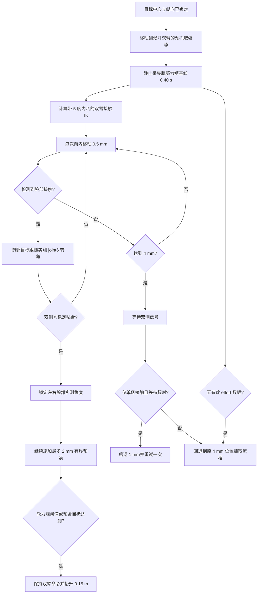

# 双臂柔顺抓取实现说明

本文说明当前比赛客户端中双臂抓取模块的实现方式、控制流程、关键参数、任务复用关系及调试方法。

## 1. 实现目标

原抓取流程完全依赖双臂位置控制：根据目标中心计算两侧末端位姿，然后持续向内收紧。该方法能够完成抓取，但存在以下问题：

- 两侧接触时间不一致时，先接触的一侧容易推动或旋转物块；
- 腕部姿态固定，夹持面不一定能与物块表面充分贴合；
- 运输时间较长时，接触面积不足可能导致物块滑落；
- 继续增加位置预紧量可能提高夹持力，但也可能挤飞物块或触发碰撞。

当前实现增加了一层基于关节位置、速度和力矩反馈的客户端柔顺控制，使双侧抓夹能够以轻微内八姿态接触物块，在接触后跟随物块表面形成的腕部转角，稳定后锁定姿态，再施加有上限的预紧力。

> 该方案是基于位置接口的导纳式“伪柔顺”控制，不是底层力矩控制。Server仍使用固定增益的位置控制器，Client不能直接修改关节刚度或切换控制模式。

## 2. 代码结构

主要实现位于：

- `examples/material_sorting/desktop_grasp/pregrasp_core.py`
  - 双臂预抓取位姿计算；
  - 双臂逆运动学；
  - 腕部力矩基线采集；
  - 接触检测、腕部随动与锁定；
  - 抓取后的升降柱抬升。
- `examples/material_sorting/executors/task1.py`
  - 抓取阶段状态机；
  - 分段内收、单侧接触退让和重试；
  - 双侧贴合后的有界预紧；
  - 缺少力矩反馈时的旧流程回退。
- `tests/test_task1_pregrasp_executor.py`
  - 内八方向、腕部随动、锁定、预紧和兼容回退测试。

任务2和任务3在自己的目标检测、对准阶段结束后，会调用任务1抽取出的通用 `GRASP`/`LIFT` 实现，因此不需要各自维护另一套抓取控制器。

## 3. 总体控制流程



## 4. 目标位姿与双臂几何

目标检测模块提供物块世界坐标：

```text
target_world = (x, y, z)
```

抓取控制器首先根据里程计将目标转换到机器人基坐标系，然后计算左右末端目标：

```text
arm_center  = target_base + (-GRASP_BACKOFF_X, 0, HAND_Z_OFFSET)
left_target = arm_center + (0, +half_width, 0)
right_target= arm_center + (0, -half_width, 0)
```

物块方向使用两种标定尺寸：

| 朝向 | 平面半尺寸 `(x, y)` | 使用任务 |
|---|---:|---|
| `yaw0` | `(0.12, 0.08) m` | 任务1 |
| `yaw90` | `(0.08, 0.12) m` | 任务2、任务3 |

抓取半宽根据物块朝向和机器人当前朝向计算，而不是简单使用固定世界坐标偏移。

## 5. 双臂轻微内八

接触阶段在原末端标定旋转矩阵基础上增加基坐标系竖直轴旋转：

```python
TOE_IN_ANGLE_RAD = math.radians(5.0)

LEFT_CONTACT_ROT = Rz(-5 deg) @ LEFT_A_ROT
RIGHT_CONTACT_ROT = Rz(+5 deg) @ RIGHT_A_ROT
```

左右两侧符号相反，因此两个抓夹朝向物块中心形成对称内八。旋转施加在机器人基坐标系中，可以保持抓夹接触面基本竖直，避免错误地绕工具轴产生翻滚。

内八只在接触抓取阶段使用；张开双臂、运输、放置和收臂阶段不被修改。

## 6. 腕部反馈与接触检测

柔顺控制使用左右腕部末端关节：

```text
left_arm_joint6
right_arm_joint6
```

在 `ArmCommand` 扁平向量中的索引为：

```python
LEFT_WRIST_VECTOR_INDEX = 8
RIGHT_WRIST_VECTOR_INDEX = 15
```

### 6.1 力矩基线

双臂开始向内运动之前，保持预抓取姿态并采集：

- 时间：`0.40 s`；
- 最少样本：`8`；
- 基线值：样本中位数；
- 噪声估计：中位绝对偏差（MAD）。

每侧自适应接触阈值为：

```text
effort_threshold = max(
    0.35,
    5.0 * 1.4826 * MAD
)
```

这样可以避免把静态负载和小幅传感器噪声误认为物块接触。

### 6.2 力矩滤波

实时力矩采用一阶指数滤波：

```text
filtered = 0.25 * current + 0.75 * previous
```

力矩变化量为：

```text
effort_delta = abs(filtered_effort - baseline_effort)
```

只有机械臂位置基本稳定后，力矩证据才允许启动接触锁存，以减少加速力矩引起的误判。接触证据需要持续 `0.15 s` 才确认。

Server提供的双侧抓取接触信号也可以作为接触证据，但仍会继续执行腕部贴合和锁定过程。

## 7. 腕部随动与锁定

检测到某侧接触后，不再强迫该侧腕部回到原固定角度，而是把 `joint6` 的位置目标更新为当前实测角度：

```text
wrist_command <- measured_wrist_position
```

该目标限制在原始IK角度的正负 `8°` 范围内，防止腕部异常旋转。

认为该侧已经贴合需要同时满足：

- 腕部相对基线转动至少 `1.5°`，或者Server已确认接触；
- 力矩变化超过自适应阈值，或者Server已确认接触；
- 腕部速度不超过 `0.05 rad/s`；
- 上述状态连续稳定 `0.20 s`。

稳定后记录当前实测角度，并将其固定为后续预紧、抬升和运输阶段的腕部目标，避免恢复到原始刚性姿态。

## 8. 分段接触搜索与预紧

### 8.1 接触前柔顺搜索

| 参数 | 当前值 |
|---|---:|
| 单步内收量 | `0.0005 m` |
| 步进间隔 | `0.25 s` |
| 接触前最大累计内收 | `0.004 m` |
| 最大位置搜索等待 | `2.0 s` |

相比原流程的 `1 mm` 步进，新流程使用 `0.5 mm`，减小第一次接触时的冲击和单侧推箱风险。

### 8.2 单侧接触恢复

达到 `4 mm` 后，如果只有一侧检测到稳定接触：

1. 双臂退回 `1 mm`；
2. 清除本轮接触锁存；
3. 再执行一次柔顺接触搜索。

最多重试一次。仍无法获得稳定双侧信号时，自动回退到经过验证的旧版有界位置抓取流程，避免因为力矩数据质量不佳导致整个任务永久阻塞。

### 8.3 双侧贴合后的预紧

左右腕部均贴合并锁定后，以 `0.5 mm` 步长继续预紧：

| 参数 | 当前值 |
|---|---:|
| 预紧步长 | `0.0005 m` |
| 预紧间隔 | `0.20 s` |
| 对齐后附加预紧 | 最多 `0.002 m` |
| 总内收绝对上限 | `0.006 m` |
| 力矩增量软停止阈值 | `2.5` |
| 腕部绝对力矩安全限值 | `6.0` |

实际目标保证不会比原来的 `4 mm` 有界预紧更松：

```text
target_preload = min(
    6 mm,
    max(4 mm, current_offset + 2 mm)
)
```

任一腕部力矩增量达到软阈值后停止继续加压；任一腕部绝对力矩达到安全限值时，抓取阶段直接安全阻止。

## 9. 抬升与夹持保持

抓取完成后，`SlideLiftController` 仅抬升升降柱，目标高度增加：

```text
LIFT_HEIGHT = 0.15 m
```

左右机械臂、抓夹开度以及已锁定的腕部角度均继承抓取结束时的命令。因此抬升不会重新计算另一组抓取IK，也不会主动解除已经形成的夹持预紧。

后续任务执行器继续保存并复用该 `ArmCommand`，直到进入明确的放置松夹或收臂阶段。

## 10. 三个任务如何复用

| 任务 | 抓取来源 | 目标朝向 | 抓取实现 |
|---|---|---|---|
| 任务1 | 桌面彩色物块 | `yaw0` | 通用预抓取、柔顺接触、预紧、抬升 |
| 任务2 | 货架彩色物块 | `yaw90` | 完成货架中心检测和底盘对准后调用相同抓取、抬升流程 |
| 任务3 | 桌面白色正方体顶部彩色物块 | `yaw90` | 完成顶部物块检测后调用相同抓取、抬升流程 |

目标检测、底盘对准和放置策略仍由各任务自己的执行器负责；柔顺改动只作用于通用抓取阶段。

## 11. 兼容与安全回退

当 `/joint_states.effort` 缺失、长度不足或包含非有限数值时：

- 不启用腕部力矩柔顺；
- 不因缺少力矩数据阻止任务；
- 自动沿用原来的有界位置抓取与Server接触确认逻辑；
- 日志显示 `compliance=legacy_no_effort`。

如果已经启用柔顺，但一次退让重试后仍没有稳定双侧接触，则日志显示：

```text
compliance=legacy_fallback:no_stable_bilateral_signal
```

这表示任务继续使用旧抓取完成条件，并不代表程序崩溃。

## 12. 关键日志

正常启用柔顺时应依次看到类似内容：

```text
calibrating wrist effort
compliance=baseline; samples=.../8
compliance=active
left[contact=True, aligned=False, ...]
right[contact=True, aligned=False, ...]
left[contact=True, aligned=True, ...]
right[contact=True, aligned=True, ...]
post-alignment preload
bilateral compliant grasp settled
```

常见异常判断：

| 日志 | 含义 |
|---|---|
| `legacy_no_effort` | Server没有提供可用腕部力矩，正在使用旧抓取 |
| `contact=True, aligned=False` | 已接触但腕部尚未稳定贴合 |
| 一侧长期 `contact=False` | 目标中心、底盘横向对准或双臂半宽可能存在误差 |
| `single-side contact backoff` | 单侧先接触，已经后退1 mm重试 |
| `no_stable_bilateral_signal` | 柔顺重试失败，已回退旧抓取 |
| `wrist effort reached the 6.0 N.m safety limit` | 腕部绝对力矩达到安全上限，任务被阻止 |

可以从完整日志中提取相关信息：

```bash
grep -E "compliance=|contact=|aligned=|effort_delta|preload|blocked" \
  /tmp/client_task123_random.log
```

## 13. 参数调节建议

建议一次只修改一个参数，并使用相同随机种子进行前后对比。

### 抓夹仍容易滑落

优先顺序：

1. 检查左右是否都出现 `aligned=True`；
2. 检查是否过早触发 `WRIST_PRELOAD_SOFT_LIMIT_DELTA`；
3. 将 `COMPLIANT_POST_ALIGN_PRELOAD_M` 从 `0.002` 小幅提高；
4. 必要时再提高 `COMPLIANT_ABSOLUTE_MAX_M`，但必须同步观察碰撞和力矩。

### 接触时容易推动物块

优先顺序：

1. 检查目标中心与底盘横向对准误差；
2. 减小 `COMPLIANT_SOFT_STEP_M`；
3. 延长 `COMPLIANT_SOFT_INTERVAL_S`；
4. 将 `TOE_IN_ANGLE_RAD` 在较小范围内重新标定。

### 经常出现单侧接触

这通常首先是几何对准问题，而不是夹持力不足。应检查：

- RGB-D目标中心是否稳定；
- 机器人是否正对目标中心；
- 物块朝向是否使用正确的 `yaw0`/`yaw90`；
- 左右目标半宽是否与物块尺寸一致。

不建议通过无限增加预紧量掩盖中心误差。

## 14. 自动化验证

抓取相关测试覆盖：

- 左右末端 `5°` 对称内八；
- 力矩接触后的腕部角度跟随与锁定；
- 锁定角度在后续预紧IK中保持；
- 缺失力矩反馈时旧流程仍可用；
- 对齐后额外预紧且总量不少于原 `4 mm`。

运行命令：

```bash
cd /workspace/baseline
python3 -m unittest \
  tests.test_task1_pregrasp_executor \
  tests.test_desktop_grasp
```

本地实现完成时，抓取相关回归测试以及任务调度、导航和货架集成回归共 `78` 项通过。

## 15. 当前限制

- Client不能修改Server的关节刚度、阻尼或直接输出关节力矩；
- 力矩阈值依赖仿真Server提供的 `JointState.effort` 质量；
- 腕部随动仍通过不断更新位置目标实现，不等同于零刚度自由关节；
- 柔顺控制只能缓解小范围中心误差，不能替代准确的RGB-D目标中心和底盘对准；
- 参数目前来自仿真标定，正式比赛前仍需用多个随机场景统计成功率、滑落率和接触峰值。

