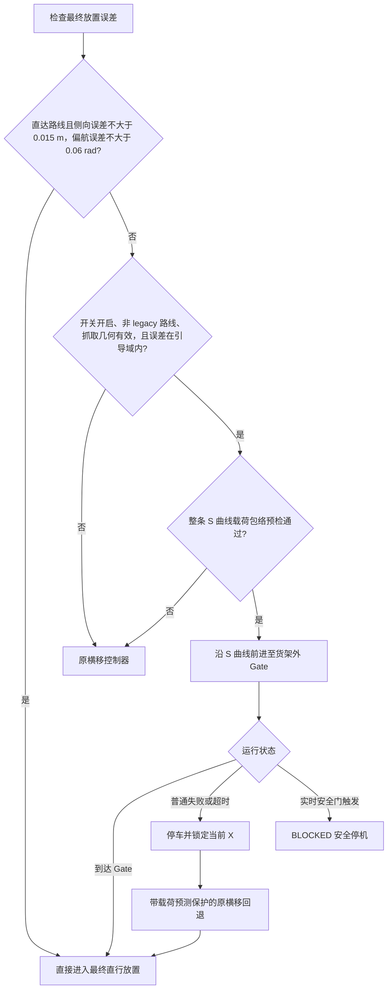

# Task 1 引导式货架接近与 GS 仿真工作流技术报告

## 1. 文档信息

| 项目 | 内容 |
|---|---|
| 适用分支 | `guided-shelf-approach` |
| 功能提交 | `b44e6473a93c108f49f84c422977424f6297c6ce` |
| 基准提交 | `f51100f63797915b8b04ffd31525070ed00f8eee` |
| 编写日期 | 2026-09-02 |
| 主要任务 | Task 1 携物到货架、末端对齐、放置和仿真验证 |
| 默认开关 | `MATERIAL_TASK1_GUIDED_APPROACH=1`，默认启用 |

本文档说明 `guided-shelf-approach` 分支相对基准版本的全部代码改动，重点解释 Task 1 为什么会在货架前发生重复横移对齐、引导式前进微调如何解决该问题、控制器的适用边界与安全回退，以及三终端 GS 仿真和 Excel 报告的使用方法。

本文档不把 `simulation_artifacts/` 中的日志、进程标记、临时环境文件或 Excel 文件纳入版本控制；文中的验证结论来自本地保存的原始仿真日志。

## 2. 结论摘要

原实现并非“没有路径规划”。机器人从桌面到货架观察位仍使用现有分层占据栅格、A* 路径和导航控制器完成全局移动与避障。问题发生在全局导航结束后的货架末端对齐阶段：全局规划负责把底盘送到安全观察位，但最终放置要求的是“手中物体中心”与货架目标层中心对齐，两者并不是同一个控制目标。

旧控制器发现数厘米侧向误差后，会依次执行：

1. 原地转向货架横向；
2. 沿货架横向平移；
3. 原地恢复面向货架的朝向；
4. 再沿直线进入目标层。

三个子阶段共享 30 秒超时。仿真中即使侧向误差只有约 3～4 cm，也可能触发两次较大的原地转向；底盘弱响应、角速度收敛和里程计残差会继续消耗超时预算，最终可能在“恢复货架朝向”阶段失败。上层随后按既有安全设计进入 `BLOCKED`，控制器取消底盘命令，所以机器人表现为停止不动。

新方案没有替换全局规划，也没有取消旧控制器。它在以下严格条件下，将全局直达路线留下的小侧向误差融合到向货架外部过渡 Gate 的前进过程中：底盘以有界的 S 形参考曲线前进，同时施加小偏航角，曲线终点恢复货架朝向。这样可减少“转 90°—横移—转回”的冗余动作。对超出适用范围、缺少实测抓取几何或预检不安全的情况，系统仍使用原横移控制器。

## 3. 改动范围

本次功能提交涉及 8 个文件：

| 文件 | 类型 | 改动说明 |
|---|---|---|
| `discoverse/envs/simulator.py` | 修改 | 为 XWayland 未标记 primary monitor 的情况预置 1920×1080 屏幕尺寸，避免窗口初始化使用未定义尺寸。 |
| `examples/material_sorting/executors/task1_full.py` | 修改 | 在 Task 1 放置对齐状态机中接入引导式 Gate 接近、启用开关、实测载荷几何、预检回退和运行期回退。 |
| `examples/material_sorting/executors/transfer_support.py` | 修改 | 实现零端点斜率 S 曲线、闭环横向误差修正、整段载荷包络预检、逐控制周期安全检查和有界速度控制。 |
| `examples/material_sorting/reference/server/material_sorting_server.py` | 修改 | 兼容标准 ROS 2 环境中没有 `ros2_runtime` 的情况，支持不同服务器目录布局和 `MATERIAL_ASSETS_DIR`。 |
| `scripts/run_client.sh` | 修改 | 使用 `python3 -m perception.box_detect` 启动检测模块，使包内导入和当前工作目录更稳定。 |
| `scripts/export_simulation_xlsx.py` | 新增 | 使用 Python 标准库将 Markdown 汇总和客户端状态日志导出为多工作表 XLSX。 |
| `scripts/run_gs_simulation.sh` | 新增 | 提供三终端、多轮、固定/随机种子 GS 仿真启动与报告工作流。 |
| `tests/test_shelf_integration.py` | 修改 | 增加引导控制选择、关闭开关回退、弱响应收敛、越界/货架相交拒绝等回归测试。 |

`competition_controller.py` 没有在本次提交中修改。其 `BLOCKED` 处理、执行器取消和底盘停机行为保持原样。

## 4. 原因分析

### 4.1 全局路径规划负责什么

Task 1 从桌面到货架区域时，现有系统仍使用：

- 分层场景占据栅格；
- A* 路径搜索；
- 路径平滑和导航控制器；
- 静态障碍物与底盘安全间距；
- 携物场景下的安全检查。

全局规划的目标是底盘安全站位，并不直接优化末端执行器或手中物体的最终放置误差。栅格分辨率、路径平滑、底盘跟踪误差、里程计误差和实际抓取后物体相对底盘的偏移，都会在观察位留下厘米级残差。

### 4.2 放置目标为什么不能只看底盘位置

最终需要对齐的是手中物体中心。设：

- `p_place` 为识别出的目标层世界坐标；
- `c_held` 为抓取锁定后物体中心在底盘坐标系中的位置；
- `R(yaw)` 为底盘朝向旋转；
- `p_base` 为所需底盘位置。

则最终站位由下式得到：

```text
p_base = p_place - R(yaw) * c_held
```

实现使用 `stand_from_held_center()` 计算该站位，而不是把一个固定底盘坐标当作所有抓取姿态的通用放置点。因此，抓取深度、物体横向偏置和夹持宽度都会影响最终站位与安全包络。

### 4.3 旧横移为什么容易出现冗余

旧 `begin_lateral_alignment()`/`tick_lateral_alignment()` 控制器是确定性的“转向—直行—恢复朝向”控制器。它适合较大横向误差和通用回退场景，但对 3～4 cm 的小误差存在以下代价：

- 为很短的横移执行两次显著转向；
- 三个阶段共同占用 `LATERAL_TIMEOUT_S=30.0`；
- 弱底盘响应会延长转向和恢复朝向；
- 横移后的里程计残差可能要求继续微调；
- 携物时每次转向都会扩大机械臂和物体的扫掠区域。

所以问题不在于“只做了避障”，而在于全局规划和货架末端控制的目标层次不同，旧末端控制又没有针对小误差设计连续曲率的前进修正。

## 5. 新状态机决策

Task 1 到达货架安全观察位并得到最终放置目标后，在 `check_place_alignment` 中按以下顺序决策：



该流程保留三个重要边界：

1. 只有通过直达 A* 路线到达货架的 Task 1 才使用新控制器；legacy 转弯路线保持原逻辑。
2. S 曲线只到达货架外部 Gate，不负责穿入货架；最终进入目标层仍使用原有固定朝向直行阶段。
3. 新控制器只使用抓取时锁定的 `held_center_base` 和 `held_grasp_half_width`，放置阶段不重新猜测物体几何。

## 6. 货架外 Gate

Gate 的目的，是在载荷完整位于货架外时完成侧向修正并恢复最终朝向。物体中心到货架前沿的要求距离为：

```text
gate_clearance = box_radius
               + carried_envelope_clearance
               + guided_gate_buffer
```

当前参数为：

```text
box_radius = hypot(0.08, 0.12) + 0.015 ≈ 0.1592 m
carried_envelope_clearance = 0.0200 m
guided_gate_buffer = 0.0500 m
gate_clearance ≈ 0.2292 m
```

货架前沿 `SHELF_FRONT_X=-2.465 m`，因此面向西侧货架时，Gate 处目标物体中心的 X 约为：

```text
-2.465 + 0.2292 ≈ -2.2358 m
```

底盘 Gate 坐标仍需通过实测 `c_held` 反算。Y 坐标沿用最终放置站位的夹紧范围，避免引导控制器和最终释放使用两个不一致的货架行目标。

## 7. S 曲线与闭环控制

### 7.1 局部坐标

以最终货架朝向 `yaw_ref` 建立局部坐标。目标相对起点分解为：

```text
forward_m =  cos(yaw_ref) * dx + sin(yaw_ref) * dy
lateral_m = -sin(yaw_ref) * dx + cos(yaw_ref) * dy
```

`forward_m` 是向 Gate 的前进距离，`lateral_m` 是需要在前进过程中消除的横向误差。

### 7.2 零端点斜率参考曲线

令 `u = progress / forward_m`，并限制在 `[0, 1]`。参考横向位移使用三次 smoothstep：

```text
h(u) = 3u² - 2u³
y_ref(u) = lateral_m * h(u)
dy_ref/dx = (lateral_m / forward_m) * 6u(1-u)
```

`h'(0)=h'(1)=0`，因此起点和终点的曲线切线都与货架最终朝向一致。机器人不需要在终点再进行一次大角度“转回货架正面”。

### 7.3 横向误差反馈

仅靠开环曲线无法抵消底盘弱响应，因此每个控制周期计算：

```text
cross_track_error = y_ref - y_measured
yaw_offset = clamp(
    atan(curve_slope + 4.0 * cross_track_error),
    -0.20,
    +0.20
)
desired_yaw = yaw_ref + yaw_offset
```

这就是“在直行时加入细微偏转角”的具体实现。偏转角不是固定值，而是随曲线进度和实时横向误差连续变化；到达终点时参考斜率归零，控制目标自然恢复 `yaw_ref`。

### 7.4 速度控制

当前速度律为：

```text
linear = clamp(0.55 * forward_error, 0, 0.085 m/s)
angular = clamp(1.6 * yaw_error, -0.24, +0.24 rad/s)
```

当瞬时朝向误差超过 `0.13 rad` 时，线速度设为 0，先恢复朝向；否则线速度乘以 `max(0.20, cos(yaw_error))`，在偏航较大时自动减速。

### 7.5 到达条件

只有同时满足以下条件才认为到达 Gate：

- 前向误差位于 `[-0.015, +0.020] m`；
- 横向误差绝对值不大于 `0.015 m`；
- 最终偏航误差绝对值不大于 `0.06 rad`。

若前向超调超过 `0.015 m`，控制器返回失败，不继续向货架内推进。

## 8. 安全设计

### 8.1 启动域限制

`begin_guided_advance()` 只接受：

- `0.10 < forward_m <= 1.20 m`；
- `|lateral_m| <= 0.055 m`；
- `|initial_yaw_error| <= 0.06 rad`；
- 有效里程计、有限数值和抓取锁定的载荷几何。

任何条件不满足都在发送速度命令前拒绝引导路径，并交回旧横移控制器。

### 8.2 整段预检

控制器按最多每 `0.04 m` 一个采样点检查完整 S 曲线。每个采样位姿都使用现有 `CarriedEnvelopeChecker` 检查底盘、肩部、机械臂和手中物体相对桌子、货架及四面墙的间距。

起点或任一采样点不安全时，S 曲线不会启动。

### 8.3 实时命令保护

即使预检通过，每个控制周期仍调用 `check_command()` 预测当前速度命令造成的载荷扫掠。若实时包络不安全，返回 `EMERGENCY_STOP`，上层进入 `BLOCKED` 并保持机械臂命令，不会自动忽略安全门继续执行。

控制器持续记录 `minimum_clearance`，用于运行日志和诊断。

### 8.4 超时与回退

引导控制器超时为 35 秒。普通失败或超时时：

1. 立即输出零底盘命令；
2. 锁存当前安全位置的 X；
3. 在当前货架外距离上，把剩余 Y 误差交给旧横移控制器；
4. 为该运行期回退开启实测载荷预测保护。

若是实时安全门触发，则不回退运动，而是直接安全阻塞。

## 9. 参数表

| 参数 | 当前值 | 含义 |
|---|---:|---|
| `FINAL_PLACE_LATERAL_TOLERANCE_M` | 0.015 m | 小于该误差时可直接进入最终直行放置 |
| `DIRECT_SHELF_YAW_TOLERANCE_RAD` | 0.06 rad | 直达路线和引导入口的偏航容差 |
| `GUIDED_MAX_LATERAL_M` | 0.055 m | 引导控制器允许的最大横向修正量 |
| `GUIDED_MAX_INITIAL_YAW_ERROR_RAD` | 0.06 rad | 引导启动允许的最大初始偏航误差 |
| `GUIDED_POSITION_TOLERANCE_M` | 0.015 m | Gate 前向/横向到达容差基准 |
| `GUIDED_YAW_TOLERANCE_RAD` | 0.06 rad | Gate 最终偏航容差 |
| `GUIDED_TIMEOUT_S` | 35.0 s | 引导阶段总超时 |
| `GUIDED_GATE_BUFFER_M` | 0.05 m | 载荷包络之外的 Gate 额外缓冲 |
| `GUIDED_MAX_YAW_OFFSET_RAD` | 0.20 rad | S 曲线跟踪最大偏航偏置 |
| `GUIDED_MAX_LINEAR_MPS` | 0.085 m/s | 引导阶段最大线速度 |
| `GUIDED_MAX_ANGULAR_RPS` | 0.24 rad/s | 引导阶段最大角速度 |
| `GUIDED_CROSS_TRACK_GAIN` | 4.0 | 横向误差到偏航修正的反馈增益 |
| `PATH_SAMPLE_M` | 0.04 m | 预检路径采样间距上限 |
| `DEFAULT_CLEARANCE_M` | 0.02 m | 携物包络相对障碍物的默认净间距 |
| `LATERAL_TIMEOUT_S` | 30.0 s | 保留的旧横移控制器超时 |

这些参数是当前经过固定种子仿真的保守值，不应孤立提高速度或放宽偏航上限。参数调整必须同时检查载荷包络、Gate 位置、控制收敛和实际 GS 仿真。


## 10. 启用、关闭与回滚

### 10.1 默认启用

未设置环境变量时，Task 1 默认启用引导式接近。以下值会关闭它：

    0
    false
    no
    off

大小写不敏感，首尾空格会被去除。

### 10.2 强制恢复旧控制器

启动 Client 前执行：

    export MATERIAL_TASK1_GUIDED_APPROACH=0

关闭后，小误差也会进入原 <code>navigate_place_lateral</code> 控制器。该开关不修改全局 A*、货架识别、抓取、最终直行插入、释放或 <code>CompetitionController</code> 行为，因此可用于 A/B 对比和紧急回滚。

### 10.3 代码级测试开关

单元测试或集成代码也可调用：

    executor.set_guided_place_approach(False)

生产运行建议使用环境变量，避免在业务流程中加入临时硬编码。

## 11. 三终端 GS 仿真

### 11.1 初始化固定种子会话

以下示例执行 3 次，依次使用 20260826、20260827、20260828：

    cd /workspace/SIX-ANGELS-qzh-backup/material_sorting_task
    export MATERIAL_SIM_ID=guided_shelf_test
    export MATERIAL_SIM_RUNS=3
    export MATERIAL_SIM_RANDOM_SEED=0
    export MATERIAL_SIM_SEED_BASE=20260826
    bash scripts/run_gs_simulation.sh init

脚本会生成：

    /workspace/SIX-ANGELS-qzh-backup/simulation_artifacts/guided_shelf_test/session.env

### 11.2 三个终端

每个终端都先执行：

    cd /workspace/SIX-ANGELS-qzh-backup/material_sorting_task
    source ../simulation_artifacts/guided_shelf_test/session.env

终端 1 负责启动和按轮次重启 GS Server：

    bash scripts/run_gs_simulation.sh server

终端 2 等待每轮 Server 就绪，然后启动 Client：

    bash scripts/run_gs_simulation.sh client

终端 3 周期性刷新 Markdown 和 Excel 报告，所有轮次完成后退出：

    bash scripts/run_gs_simulation.sh report --watch

### 11.3 随机种子模式

初始化前设置：

    export MATERIAL_SIM_RANDOM_SEED=1

此时 Server 端会取消 <code>MATERIAL_SEED</code>，<code>MATERIAL_SIM_SEED_BASE</code> 不参与种子选择；脚本仍会从 Server 日志提取实际随机种子并写入每轮的 <code>actual_seed</code>。

### 11.4 主要仿真参数

| 环境变量 | 默认值 | 说明 |
|---|---:|---|
| <code>MATERIAL_SIM_RUNS</code> | 1 | 仿真次数，必须为正整数 |
| <code>MATERIAL_SIM_RANDOM_SEED</code> | 0 | 0 使用固定种子，1 使用随机种子 |
| <code>MATERIAL_SIM_SEED_BASE</code> | 20260827 | 脚本默认固定种子起点；建议显式设为需要的值 |
| <code>MATERIAL_SIM_TIMEOUT_S</code> | 720 | 每轮 Client 总超时 |
| <code>MATERIAL_SIM_READY_TIMEOUT_S</code> | 90 | 等待 Server 就绪的超时 |
| <code>MATERIAL_SIM_ID</code> | 时间戳名称 | 会话目录名 |
| <code>MATERIAL_SIM_ARTIFACT_ROOT</code> | 项目下 simulation_artifacts | 本地结果目录 |

## 12. 报告输出

<code>report</code> 模式首先从每轮的 <code>client.log</code>、退出码和运行时长生成 <code>SIMULATION_REPORT.md</code>，随后由 <code>export_simulation_xlsx.py</code> 生成 <code>SIMULATION_REPORT.xlsx</code>。

Excel 包含 4 个工作表：

| 工作表 | 内容 |
|---|---|
| <code>Run Summary</code> | 每轮种子、状态、分数、总时间、抓取/识别/放置次数和退出码 |
| <code>State Timeline</code> | 状态机每次进入 stage 的相对开始时间、持续时间、当时分数和转换消息 |
| <code>Task Summary</code> | 每个任务/尝试的起止时间、阶段数量、最大分数和终态 |
| <code>Protection Events</code> | <code>runtime input stale</code> 与 <code>controller=blocked</code> 等保护事件及日志行号 |

XLSX 由 Python 标准库的 XML 与 ZIP 功能直接生成，不新增 openpyxl 依赖。

这些报告是仿真产物，默认不提交 Git。若需要留档，应单独选择脱敏后的汇总文档，不应提交原始进程标记和临时环境文件。

## 13. 固定种子验证结果

本地会话 <code>guided_approach_validation_20260901</code> 使用固定种子起点 20260826，执行 3 次。原始汇总为：

| 轮次 | 种子 | 报告分数 | Client 时间 | Client 退出码 | Task 1 进入 verify_place |
|---:|---:|---:|---:|---:|---|
| 1 | 20260826 | 40 | 238 s | 124 | 是 |
| 2 | 20260827 | 30 | 184 s | 0 | 是 |
| 3 | 20260828 | 30 | 201 s | 0 | 是 |

引导阶段日志观测如下：

| 种子 | 首条横向误差 | 末条横向误差 | 日志观测窗口 | 最大已记录偏航偏置 | 最小已记录净间距 |
|---:|---:|---:|---:|---:|---:|
| 20260826 | 0.037 m | 0.000 m | 10.10 s | 0.118 rad | 0.075 m |
| 20260827 | 0.039 m | 约 0.000 m | 20.29 s | 0.123 rad | 0.075 m |
| 20260828 | 0.039 m | 约 0.000 m | 22.41 s | 0.123 rad | 0.075 m |

“日志观测窗口”是首条到末条周期性进度日志的时间差，不等同于精确状态持续时间；实际状态转换可能发生在下一条周期日志之前。

三次运行均记录了 Task 1 从引导接近进入放置并到达 <code>verify_place</code>，引导阶段没有出现 <code>controller=blocked</code>。第 1 次运行的退出码 124 是整个 Client 达到总超时后的结果；日志已经记录 Task 1 返回终点、进入 <code>waiting_for_referee</code> 且分数到达 40。因此它不能被解释为“引导控制器超时”，但也不能据此宣称该轮完整 Task 1/2/3 会话正常结束。第 2、3 次 Client 退出码为 0。

## 14. 自动测试覆盖

新增或强化的关键测试包括：

- 直达误差已经在 0.015 m 内时跳过引导和三段横移；
- 小幅、已锁存的放置误差选择 <code>approach_place_guided</code>；
- <code>set_guided_place_approach(False)</code> 恢复旧横移控制器；
- 引导逻辑不破坏 Task 3 复用 Task 1 transport 执行器的阶段兼容性；
- 在仅有 30% 线速度响应、25% 角速度响应并带角速度偏置的弱响应模型下仍收敛；
- 最大偏航偏置保持在 0.20 rad 内；
- 超出引导适用域或路径与货架包络相交时，预检拒绝启动；
- 旧横移控制器的转向、移动、恢复朝向、超时和倒车安全行为仍保留。

2026-09-02 在当前分支重新运行货架集成测试，66 项全部通过；实施阶段也已完成更宽范围回归测试。后续改动参数时，应至少重新运行 <code>test_shelf_integration.py</code> 及 Task 1 相关测试，再进行固定种子和随机种子 GS 仿真。

## 15. 日志诊断

引导控制器正常运行时，Client 日志包含：

    task 1 correcting the final approach while moving forward;
    guided shelf approach following bounded S-curve outside shelf;
    forward_err=... lateral_err=... yaw_offset=... minimum_clearance=...

常见终态及含义：

| 日志关键字 | 含义 | 处理 |
|---|---|---|
| <code>reached outside transition Gate</code> | Gate 位置、横向误差和偏航均满足容差 | 进入最终直行放置 |
| <code>timed out</code> | 引导阶段超过 35 秒 | 停车并切换带保护的旧横移回退 |
| <code>overshot its outside transition Gate</code> | 前向超调超过允许范围 | 停车并切换回退 |
| <code>was not started</code> | 状态机调用顺序或内部状态异常 | 停车并切换回退 |
| <code>carried-envelope guard stopped motion</code> | 实时载荷扫掠不安全 | BLOCKED，不自动继续运动 |
| <code>could not plan safe lateral shelf placement alignment</code> | 引导回退或旧横移也无法安全规划 | BLOCKED |

排查时应同时查看 <code>State Timeline</code>、<code>Protection Events</code> 和原始 <code>client.log</code>，不能仅依据 GUI 中“机器人不动”判断模块故障。机器人在 BLOCKED 后保持不动是预期的安全结果。

## 16. 已知限制

1. 新控制器只用于 Task 1、直达路线和不超过 0.055 m 的小横向误差，不是通用局部规划器。
2. 它检查当前静态场景与携物包络，不负责动态障碍物预测。
3. 控制精度依赖里程计和抓取阶段锁存的载荷几何；几何缺失时会回退旧控制器。
4. 超出适用域或 legacy 路线仍可能进入旧三段横移，其 30 秒超时行为仍需保留诊断。
5. 当前 GS 证据为 3 个固定种子，能证明已覆盖的路径有效，但不足以形成统计意义上的 95% 成功率结论。
6. 日志中的净间距来自仿真几何模型，不等于真实机器人标定误差下的物理测量。
7. 第 1 次验证会话在 Task 1 完成本地序列后发生整场 Client 超时，完整裁判推进和 Task 2/3 长时运行仍应独立验证。
8. Excel 汇总依赖现有日志格式；若状态日志字段改变，导出脚本的正则解析也必须同步更新。

## 17. 后续验收建议

建议按以下顺序继续验收：

1. 使用 <code>MATERIAL_TASK1_GUIDED_APPROACH=0</code> 和 1 对同一固定种子进行 A/B 对比；
2. 至少覆盖目标空层 L1、L2、L3；
3. 统计引导阶段耗时、最大偏航偏置、最小净间距、回退次数和 BLOCKED 次数；
4. 扩大到随机种子批量仿真，单独统计 Task 1 放置成功率和完整任务成功率；
5. 对任何回退样本保存对应种子和首个失败日志，而不是只记录最终分数；
6. 完成实体机或高保真标定后，再评估是否调整 0.055 m 适用域或速度上限。

只有在随机种子覆盖、完整裁判流程、极限抓取偏置和载荷安全间距均通过后，才适合扩大引导控制器的适用范围。当前实现的主要价值是以小范围、可关闭、可回退的方式消除已观察到的冗余横移，而不是在证据不足时替换整个导航体系。